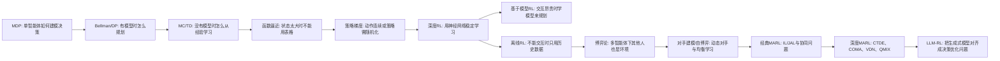

# 多智能体系统与强化学习 7小时90分复习全稿

> 适用目标：从 0 开始，在 7 小时内把课程主线、核心公式、常见大题、计算题模板、开放题表达全部过一遍。  
> 说明：我不能真实保证期末一定 90 分，但这份稿子的目标就是按“尽量拿 90+”组织：先抓住主线，再背公式，再练计算和开放题模板。  
> 主要依据：本目录课程课件 `01-02 强化学习基础 时差学习.pdf`、`03 函数估计.pdf`、`04 策略梯度.pdf`、`05 深度强化学习.pdf`、`06 基于模型的强化学习-3.pptx`、`07 离线强化学习(1).pptx`、`08 博弈论与纳什均衡.pdf`、`09 对手建模与虚拟自博弈.pdf`、`10 经典多智能体算法.pdf`、`11 深度多智能体强化学习.pdf`、`12 LLM-RL.pdf` 以及 StudyVault 中对应章节笔记与练习。个别图片型 PDF 的文字抽取不完整，本稿以已核查的章节笔记和课件主线为准。

## 0. 7小时复习安排

| 时间 | 任务 | 目标 |
|---|---|---|
| 第 0-0.5 小时 | 读第 1 节总主线、第 15 节公式清单 | 建立全局地图，知道每章解决什么问题 |
| 第 0.5-2 小时 | 第 2-5 节：MDP、DP、MC、TD、函数逼近、策略梯度 | 拿下单智能体 RL 基础题和计算题 |
| 第 2-3.2 小时 | 第 6-8 节：DQN、A3C、PPO、MBRL、Offline RL | 拿下深度 RL 与开放题高频点 |
| 第 3.2-5 小时 | 第 9-12 节：博弈、对手建模、经典 MARL、深度 MARL | 拿下多智能体主干 |
| 第 5-6 小时 | 第 13 节 LLM-RL、第 14 节计算题模板 | 应对开放题：机器学习前沿/生成式模型/LLM-RL |
| 第 6-7 小时 | 做 `期末模拟试卷.md`，对照答案改错 | 把“懂了”变成“会写” |

考试冲刺原则：

1. 先背“为什么引入该方法”，再背公式。大题最爱问方法动机、问题、机制、优缺点。
2. 计算题常来自课堂练习，优先练 TD、SARSA、Q-learning、$\epsilon$-greedy、策略梯度、PPO clip、纳什均衡判断、VDN/QMIX。
3. 开放题要写成“问题背景 → 关键挑战 → 代表方法 → 优缺点 → 应用场景”，别只堆名词。

## 1. 全课程主线：从一个智能体到一群智能体

整门课可以串成一条线：

每章“为什么要引入”的逻辑：

| 已有方法 | 遇到的问题 | 所以下一章引入 |
|---|---|---|
| MDP/DP | 需要已知环境模型 $P,R$，现实中通常没有 | MC/TD 从采样经验学习 |
| MC | 要等完整 episode，方差大 | TD 用一步 bootstrap 更快更新 |
| 表格 TD/Q-learning | 状态/动作巨大或连续，表格存不下 | 函数逼近 |
| 值函数方法 | 连续动作、随机策略、直接优化策略困难 | 策略梯度与 Actor-Critic |
| 普通函数逼近 | 神经网络 + bootstrapping + off-policy 不稳定 | DQN、A3C、PPO 等深度 RL |
| Model-free 深度 RL | 样本效率低，真实交互昂贵 | 基于模型 RL、Dyna、MPC |
| 在线/Off-policy RL | 医疗、自动驾驶等不能随便在线试错 | 离线 RL、BCQ、CQL |
| 单智能体 RL | 其他智能体也会学习，环境非平稳 | 博弈论、纳什均衡、MARL |
| 独立 MARL | 非平稳、协同困难、信度分配 | CTDE、COMA、VDN、QMIX |
| 传统 RL | 生成式大模型需要人类/规则反馈对齐 | RLHF、RLAIF、RLVR、DPO、GRPO |

## 2. 强化学习基础：MDP 是一切的起点

### 2.1 强化学习在解决什么问题

强化学习研究的是：智能体在环境中反复行动，根据奖励学习长期收益最大的策略。

核心元素：

| 元素 | 记号 | 含义 |
|---|---|---|
| 状态 | $s\in S$ | 当前环境信息 |
| 动作 | $a\in A$ | 智能体可选择的行为 |
| 奖励 | $r$ 或 $R(s,a)$ | 当前行为的即时反馈 |
| 策略 | $\pi(a\mid s)$ | 状态到动作分布的映射 |
| 转移 | $P(s'\mid s,a)$ | 执行动作后到下一状态的概率 |
| 折扣因子 | $\gamma\in[0,1]$ | 未来奖励的重要程度 |

RL 与监督学习区别：

| 维度 | 监督学习 | 强化学习 |
|---|---|---|
| 数据 | 固定标注数据 | 数据由策略与环境交互产生 |
| 反馈 | 每个样本有标签 | 奖励可能延迟、稀疏 |
| 目标 | 预测正确 | 最大化长期累计奖励 |
| 难点 | 泛化 | 探索-利用、延迟奖励、分布随策略变化 |

### 2.2 MDP：把顺序决策数学化

MDP 通常写作：

$$
\mathcal{M}=\langle S,A,P,R,\gamma\rangle
$$

有些课件也写作 $\langle S,A,\delta,R\rangle$，其中 $\delta$ 表示状态转移规则。核心是一样的：下一状态只依赖当前状态和当前动作，而不依赖更早历史。

Markov 性：

$$
P(S_{t+1}\mid S_t,A_t,S_{t-1},A_{t-1},\dots)=P(S_{t+1}\mid S_t,A_t)
$$

一句话：只要当前状态 $S_t$ 足够完整，过去历史就不再额外提供信息。

### 2.3 回报、价值函数和 Q 函数

折扣累计回报：

$$
G_t=R_{t+1}+\gamma R_{t+2}+\gamma^2R_{t+3}+\cdots
=\sum_{k=0}^{\infty}\gamma^kR_{t+k+1}
$$

状态价值：

$$
V^\pi(s)=\mathbb{E}_\pi[G_t\mid S_t=s]
$$

动作价值：

$$
Q^\pi(s,a)=\mathbb{E}_\pi[G_t\mid S_t=s,A_t=a]
$$

两者关系：

$$
V^\pi(s)=\sum_a\pi(a\mid s)Q^\pi(s,a)
$$

若策略是确定性的 $\pi(s)$：

$$
V^\pi(s)=Q^\pi(s,\pi(s))
$$

最优状态价值与最优动作价值：

$$
V^*(s)=\max_\pi V^\pi(s),\qquad Q^*(s,a)=\max_\pi Q^\pi(s,a)
$$

最优策略：

$$
\pi^*(s)=\arg\max_a Q^*(s,a)
$$

### 2.4 Bellman 方程：价值能递归定义

Bellman 期望方程：

$$
V^\pi(s)=\sum_a\pi(a\mid s)\sum_{s',r}P(s',r\mid s,a)\left[r+\gamma V^\pi(s')\right]
$$

动作价值形式：

$$
Q^\pi(s,a)=\sum_{s',r}P(s',r\mid s,a)\left[r+\gamma\sum_{a'}\pi(a'\mid s')Q^\pi(s',a')\right]
$$

Bellman 最优方程：

$$
V^*(s)=\max_a\sum_{s',r}P(s',r\mid s,a)\left[r+\gamma V^*(s')\right]
$$

$$
Q^*(s,a)=\sum_{s',r}P(s',r\mid s,a)\left[r+\gamma\max_{a'}Q^*(s',a')\right]
$$

记忆方式：  
期望方程是“按当前策略平均”；最优方程是“对动作取最大”。

### 2.5 动态规划：知道模型时怎么求解

动态规划要求已知模型 $P,R$。

策略评估：给定 $\pi$，反复更新 $V^\pi$。

$$
V_{k+1}(s)=\sum_a\pi(a\mid s)\sum_{s',r}P(s',r\mid s,a)\left[r+\gamma V_k(s')\right]
$$

策略改进：根据当前价值变贪心。

$$
\pi'(s)=\arg\max_a\sum_{s',r}P(s',r\mid s,a)\left[r+\gamma V^\pi(s')\right]
$$

策略迭代：

1. 策略评估：求 $V^\pi$。
2. 策略改进：让 $\pi$ 对 $V^\pi$ 贪心。
3. 重复直到策略稳定。

价值迭代：把评估和改进合在一起。

$$
V_{k+1}(s)=\max_a\sum_{s',r}P(s',r\mid s,a)\left[r+\gamma V_k(s')\right]
$$

考试要会说：DP 很强，但现实中模型通常未知，所以后面要引入从经验学习的 MC/TD。

### 2.6 探索与利用：$\epsilon$-greedy

$\epsilon$-greedy：以 $1-\epsilon$ 的概率选当前最优动作，以 $\epsilon$ 的概率随机探索。

若动作数为 $|A|$，贪心动作概率是：

$$
P(a^*)=1-\epsilon+\frac{\epsilon}{|A|}
$$

非贪心动作概率是：

$$
P(a)=\frac{\epsilon}{|A|}
$$

例：两个动作，$\epsilon=0.2$，贪心动作概率 $0.8+0.1=0.9$，另一个动作概率 $0.1$。

## 3. MC、TD、SARSA、Q-learning：不知道模型时怎么学

### 3.1 为什么从 DP 走向 MC/TD

DP 需要知道环境模型 $P,R$。现实中我们常常只知道“我做了动作后发生了什么”，不知道完整转移概率。因此需要 model-free 方法。

| 方法 | 是否需要模型 | 是否采样 | 是否 bootstrap |
|---|---|---|---|
| DP | 需要 | 否 | 是 |
| MC | 不需要 | 是 | 否 |
| TD | 不需要 | 是 | 是 |

Bootstrap：用当前估计值的一部分来更新当前估计值。例如 TD 用 $V(S_{t+1})$ 估计未来。

### 3.2 Monte Carlo：等 episode 结束，用真实回报更新

MC 更新：

$$
V(S_t)\leftarrow V(S_t)+\alpha\left[G_t-V(S_t)\right]
$$

优点：目标 $G_t$ 是真实采样回报，无 bootstrap 偏差。  
缺点：必须等 episode 结束，方差大，不适合连续任务。

First-visit MC：一个 episode 中某状态第一次出现才更新。  
Every-visit MC：每次出现都更新。

### 3.3 TD(0)：一步更新，边走边学

TD(0) 目标：

$$
R_{t+1}+\gamma V(S_{t+1})
$$

TD 误差：

$$
\delta_t=R_{t+1}+\gamma V(S_{t+1})-V(S_t)
$$

TD 更新：

$$
V(S_t)\leftarrow V(S_t)+\alpha\delta_t
$$

TD 与 MC 对比：

| 维度 | MC | TD |
|---|---|---|
| 更新时机 | episode 结束后 | 每一步 |
| 目标 | 完整回报 $G_t$ | $R+\gamma V(S')$ |
| 方差 | 高 | 低 |
| 偏差 | 无 bootstrap 偏差 | 有 bootstrap 偏差 |
| 连续任务 | 不方便 | 适合 |

### 3.4 SARSA：on-policy 控制

SARSA 名字来自五元组：

$$
(S_t,A_t,R_{t+1},S_{t+1},A_{t+1})
$$

更新：

$$
Q(S_t,A_t)\leftarrow Q(S_t,A_t)+\alpha\left[R_{t+1}+\gamma Q(S_{t+1},A_{t+1})-Q(S_t,A_t)\right]
$$

关键：目标中用的是实际按照当前策略选出来的 $A_{t+1}$，因此是 on-policy。

### 3.5 Q-learning：off-policy 控制

Q-learning 更新：

$$
Q(S_t,A_t)\leftarrow Q(S_t,A_t)+\alpha\left[R_{t+1}+\gamma\max_a Q(S_{t+1},a)-Q(S_t,A_t)\right]
$$

关键：行为策略可以探索，但目标策略始终对 $Q$ 贪心，因此是 off-policy。

SARSA vs Q-learning 高频对比：

| 维度 | SARSA | Q-learning |
|---|---|---|
| 类型 | On-policy | Off-policy |
| TD 目标 | $R+\gamma Q(S',A')$ | $R+\gamma\max_aQ(S',a)$ |
| 是否考虑探索风险 | 考虑 | 不考虑 |
| Cliff Walking | 学到更安全路径 | 学到贴近悬崖的最短路径 |

### 3.6 多步 TD 与资格迹

n-step return：

$$
G_t^{(n)}=R_{t+1}+\gamma R_{t+2}+\cdots+\gamma^{n-1}R_{t+n}+\gamma^nV(S_{t+n})
$$

$\lambda$-return：

$$
G_t^\lambda=(1-\lambda)\sum_{n=1}^{\infty}\lambda^{n-1}G_t^{(n)}
$$

$\lambda=0$ 时接近 TD(0)，$\lambda=1$ 时接近 MC。

资格迹：

$$
e_t(s)=\gamma\lambda e_{t-1}(s)+\mathbf{1}(S_t=s)
$$

更新：

$$
V(s)\leftarrow V(s)+\alpha\delta_t e_t(s)
$$

直觉：刚访问过的状态更有资格为当前 TD 误差负责。

## 4. 函数逼近：表格放不下时怎么办

### 4.1 为什么需要函数逼近

表格法要求为每个状态或状态-动作对存一个值。但现实中：

1. 状态空间巨大，例如图像、机器人关节角。
2. 状态可能连续，根本无法枚举。
3. 我们希望从见过的状态泛化到没见过的状态。

于是用参数化函数：

$$
\hat V(s,w)\approx V^\pi(s)
$$

或：

$$
\hat Q(s,a,w)\approx Q^\pi(s,a)
$$

### 4.2 目标函数与梯度更新

均方误差目标：

$$
J(w)=\mathbb{E}\left[(V^\pi(s)-\hat V(s,w))^2\right]
$$

一般 SGD 更新：

$$
\Delta w=\alpha\left[\text{target}-\hat V(s,w)\right]\nabla_w\hat V(s,w)
$$

target 可以是：

| 方法 | target |
|---|---|
| MC | $G_t$ |
| TD(0) | $R_{t+1}+\gamma\hat V(S_{t+1},w)$ |
| TD($\lambda$) | $G_t^\lambda$ |

半梯度 TD：虽然 TD 目标也含有 $w$，但更新时把目标看成常数，只对当前 $\hat V(S_t,w)$ 求梯度。

### 4.3 线性函数逼近

特征向量 $x(s)$，线性价值函数：

$$
\hat V(s,w)=w^\top x(s)
$$

梯度：

$$
\nabla_w\hat V(s,w)=x(s)
$$

线性 TD(0) 更新：

$$
w\leftarrow w+\alpha\left[R_{t+1}+\gamma w^\top x(S_{t+1})-w^\top x(S_t)\right]x(S_t)
$$

常见特征：

| 特征 | 用途 |
|---|---|
| 状态聚合 | 简单粗粒度表示 |
| Tile coding | 连续空间离散化，局部泛化 |
| RBF | 平滑局部响应 |
| Fourier | 周期/全局特征 |
| 神经网络 | 自动表示学习 |

### 4.4 Deadly Triad

三件事同时出现时可能导致不稳定或发散：

1. 函数逼近。
2. Bootstrap。
3. Off-policy。

DQN 同时具备三者，所以必须额外稳定训练：经验回放、目标网络、Double DQN 等。

### 4.5 经验回放与批量方法

经验回放保存转移：

$$
(s,a,r,s')
$$

训练时随机采样 mini-batch。作用：

1. 打破时间相关性。
2. 提高样本利用率。
3. 让训练更接近 i.i.d. 数据。

限制：On-policy 方法通常不适合随便重用旧数据，因为旧数据不是当前策略生成的。

LSTD 的思想：不用小步 SGD，而是用一批数据一次求线性 TD 的固定点。常见形式：

$$
w=\left(\sum_t x_t(x_t-\gamma x_{t+1})^\top\right)^{-1}\sum_t r_{t+1}x_t
$$

## 5. 策略梯度：直接优化策略

### 5.1 为什么要从值函数转向策略

值函数方法先学 $Q$，再取 $\arg\max_a Q(s,a)$。问题：

1. 连续动作空间里 $\arg\max$ 可能很难。
2. 有些任务需要随机策略，例如博弈、探索、部分可观测。
3. 直接优化策略更自然。

策略参数化：

离散动作 softmax：

$$
\pi_\theta(a\mid s)=\frac{\exp(h_\theta(s,a))}{\sum_b\exp(h_\theta(s,b))}
$$

连续动作 Gaussian：

$$
a\sim\mathcal{N}(\mu_\theta(s),\sigma_\theta^2(s))
$$

### 5.2 策略梯度定理

目标：

$$
J(\theta)=\mathbb{E}_{\pi_\theta}[G_0]
$$

策略梯度定理：

$$
\nabla_\theta J(\theta)=\mathbb{E}_{\pi_\theta}\left[\sum_t Q^{\pi_\theta}(S_t,A_t)\nabla_\theta\log\pi_\theta(A_t\mid S_t)\right]
$$

核心技巧是 log-derivative trick：

$$
\nabla_\theta \pi_\theta(a\mid s)=\pi_\theta(a\mid s)\nabla_\theta\log\pi_\theta(a\mid s)
$$

### 5.3 REINFORCE

用采样回报 $G_t$ 代替 $Q^\pi(S_t,A_t)$：

$$
\theta\leftarrow \theta+\alpha G_t\nabla_\theta\log\pi_\theta(A_t\mid S_t)
$$

有时写作带折扣：

$$
\theta\leftarrow \theta+\alpha\gamma^tG_t\nabla_\theta\log\pi_\theta(A_t\mid S_t)
$$

优点：无偏、简单。  
缺点：必须等 episode 结束，方差高。

### 5.4 Baseline 与 Advantage

加入只依赖状态的 baseline 不改变期望梯度：

$$
\nabla_\theta J(\theta)=\mathbb{E}\left[(G_t-b(S_t))\nabla_\theta\log\pi_\theta(A_t\mid S_t)\right]
$$

为什么不引入偏差：

$$
\sum_a b(s)\nabla_\theta\pi_\theta(a\mid s)
=b(s)\nabla_\theta\sum_a\pi_\theta(a\mid s)
=b(s)\nabla_\theta 1=0
$$

最常用 baseline 是 $V^\pi(s)$，于是得到优势函数：

$$
A^\pi(s,a)=Q^\pi(s,a)-V^\pi(s)
$$

优势的意义：这个动作比当前状态平均水平好多少。

### 5.5 Actor-Critic

Actor：学习策略 $\pi_\theta(a\mid s)$。  
Critic：学习价值 $V_w(s)$ 或 $Q_w(s,a)$，给 Actor 提供低方差评价。

TD error 可作为优势估计：

$$
\delta_t=R_{t+1}+\gamma V_w(S_{t+1})-V_w(S_t)
$$

Critic 更新：

$$
w\leftarrow w+\alpha\delta_t\nabla_wV_w(S_t)
$$

Actor 更新：

$$
\theta\leftarrow\theta+\beta\delta_t\nabla_\theta\log\pi_\theta(A_t\mid S_t)
$$

REINFORCE vs Actor-Critic：

| 维度 | REINFORCE | Actor-Critic |
|---|---|---|
| 更新目标 | 完整回报 $G_t$ | Critic/TD 估计 |
| 方差 | 高 | 低 |
| 偏差 | 低/无 | 有 Critic 偏差 |
| 更新频率 | episode 后 | 每步或多步 |

## 6. 深度强化学习：用神经网络，但要稳定

### 6.1 DQN：深度 Q-learning

DQN 用神经网络逼近最优 Q 函数：

$$
\hat Q(s,a,w)\approx Q^*(s,a)
$$

损失函数：

$$
J(w)=\mathbb{E}\left[\left(R+\gamma\max_{a'}\hat Q(S',a',w^-)-\hat Q(S,A,w)\right)^2\right]
$$

半梯度更新：

$$
\Delta w=\alpha\left(R+\gamma\max_{a'}\hat Q(S',a',w^-)-\hat Q(S,A,w)\right)\nabla_w\hat Q(S,A,w)
$$

DQN 两大稳定技巧：

| 技巧 | 解决问题 |
|---|---|
| 经验回放 | 连续样本高度相关、样本利用率低 |
| 目标网络 | TD 目标随在线网络变化，追逐移动目标 |

目标网络参数 $w^-$ 每隔一段时间从在线网络 $w$ 复制，或软更新：

$$
w^-\leftarrow \tau w+(1-\tau)w^-
$$

### 6.2 Double DQN：解决过高估计

普通 DQN 的 $\max$ 操作会放大噪声：

$$
\mathbb{E}[\max_a\hat Q(s,a)]\ge \max_a\mathbb{E}[\hat Q(s,a)]
$$

Double DQN 用在线网络选动作，目标网络评估动作：

$$
y=R+\gamma\hat Q\left(S',\arg\max_a\hat Q(S',a,w),w^-\right)
$$

一句话：把“选哪个动作最好”和“这个动作值多少”拆开，减少系统性高估。

### 6.3 Dueling DQN

把 Q 分解为状态价值和优势：

$$
Q(s,a)=V(s)+A(s,a)-\frac{1}{|A|}\sum_{a'}A(s,a')
$$

直觉：有些状态下“处在这个状态本身好不好”比动作差异更重要，分解后更容易学习。

### 6.4 A3C

A3C：Asynchronous Advantage Actor-Critic。

核心：

1. 多个 Worker 各自和环境交互。
2. 每个 Worker 计算梯度。
3. 异步推送到全局网络。

Actor 梯度：

$$
\nabla_\theta J=\mathbb{E}\left[\nabla_\theta\log\pi_\theta(a_t\mid s_t)A(s_t,a_t)\right]
$$

Critic 损失：

$$
L_V=(R-\hat V(s_t;\theta_v))^2
$$

熵正则：

$$
H(\pi)=-\sum_a\pi(a\mid s)\log\pi(a\mid s)
$$

加入熵是为了鼓励探索，防止策略过早确定化。

A3C 不需要经验回放的原因：多个 Worker 并行探索，本身提供数据多样性。

### 6.5 PPO：稳定策略梯度

On-policy 策略梯度样本效率低，因为数据来自旧策略后很快过期。PPO 想用旧策略数据多次更新，但又不能让新旧策略差太远。

重要性采样：

$$
\mathbb{E}_{x\sim p}[f(x)]
=\mathbb{E}_{x\sim q}\left[f(x)\frac{p(x)}{q(x)}\right]
$$

策略比率：

$$
r_t(\theta)=\frac{\pi_\theta(a_t\mid s_t)}{\pi_{\theta_k}(a_t\mid s_t)}
$$

PPO-Clip 目标：

$$
J_{PPO}(\theta)=\mathbb{E}\left[\min\left(r_t(\theta)A_t,\operatorname{clip}(r_t(\theta),1-\epsilon,1+\epsilon)A_t\right)\right]
$$

Clip 直觉：

| 情况 | 作用 |
|---|---|
| $A_t>0$ 且 $r_t>1+\epsilon$ | 好动作概率不能涨太多 |
| $A_t<0$ 且 $r_t<1-\epsilon$ | 坏动作概率不能降太多 |

PPO vs TRPO：

| 维度 | TRPO | PPO |
|---|---|---|
| 约束 | KL 硬约束 | KL 惩罚或 clip |
| 优化 | 共轭梯度、线搜索 | 标准 SGD |
| 实现 | 难 | 简单 |
| 工业应用 | 较少 | 很广 |

## 7. 基于模型的强化学习：交互贵时学模型

### 7.1 为什么引入 Model-Based RL

Model-free 方法直接从真实交互中学策略或价值，通常样本效率低。如果真实交互昂贵或危险，例如机器人、医疗、自动驾驶，就需要更充分利用每条经验。

Model-based RL 学环境模型：

$$
\hat P(s'\mid s,a),\qquad \hat R(s,a)
$$

或学习动态函数：

$$
\hat f(s,a)\approx s'
$$

然后用模型做规划或生成模拟数据。

| 维度 | Model-free | Model-based |
|---|---|---|
| 学什么 | 值函数/策略 | 环境模型 + 规划 |
| 样本效率 | 低 | 高 |
| 计算开销 | 较低 | 较高 |
| 风险 | 需要大量交互 | 模型误差累积 |

### 7.2 Dyna-Q

Dyna 把三件事合在一起：

1. 真实经验直接 RL 更新。
2. 用真实经验学习模型。
3. 从模型生成模拟经验做规划更新。

Dyna-Q 每步：

真实更新：

$$
Q(s,a)\leftarrow Q(s,a)+\alpha[r+\gamma\max_{a'}Q(s',a')-Q(s,a)]
$$

模型记录：

$$
Model(s,a)\leftarrow (r,s')
$$

规划更新：随机选以前见过的 $(\tilde s,\tilde a)$，用模型生成 $(\tilde r,\tilde s')$，再做 Q-learning 更新。

规划步数 $N$：

| $N$ 大 | 学得快，但更依赖模型准确性 |
| $N$ 小 | 更稳，但样本效率提升少 |

如果模型很不准，应减小 $N$，甚至退回 model-free。

### 7.3 轨迹优化与 MPC

轨迹优化：用模型预测一串动作的未来结果，选回报最高的动作序列。

问题：模型误差会随预测步数累积，后面的预测越来越不可靠。

MPC：Model Predictive Control。

核心流程：

1. 基于当前状态和模型规划未来动作序列。
2. 只执行第一个动作。
3. 观察真实下一状态。
4. 重新规划。

一句话：每一步都重新看真实环境，纠正模型误差。

### 7.4 MBPO

MBPO：Model-Based Policy Optimization。

三个阶段：

1. 从真实数据学习模型。
2. 从真实状态出发，用模型做短步 rollout。
3. 用模拟数据优化策略。

为什么只做短 rollout：长 rollout 会让模型误差累积，短 rollout 在样本效率和模型偏差之间折中。

## 8. 离线强化学习：完全不能交互时怎么办

### 8.1 为什么需要 Offline RL

离线 RL 只使用固定数据集 $D$，训练时完全不与环境交互。典型场景：医疗、自动驾驶、推荐系统历史日志。

三种范式：

| 范式 | 训练时交互 | 数据来源 |
|---|---|---|
| On-policy | 有 | 当前策略 |
| Off-policy | 有 | 当前策略 + 旧数据 |
| Offline | 无 | 固定数据集 |

关键区别：Off-policy 仍然可以继续探索新数据；Offline 完全不能纠错。

### 8.2 分布偏移与外推误差

数据由行为策略 $\pi_\beta$ 收集，学习到的策略 $\pi_\theta$ 可能选择数据集中没见过的动作。

OOD 动作：

$$
(s,a_{\text{OOD}})\notin D
$$

Q 网络对 OOD 动作只能外推，容易给出虚假高值：

$$
Q(s,a_{\text{OOD}})\ \text{被高估}
$$

然后它会进入 TD 目标：

$$
y=r+\gamma\max_{a'}Q(s',a')
$$

于是错误高估会传播到上游状态，污染整个 Q 函数。

### 8.3 行为克隆 vs 离线 RL

行为克隆 BC 是监督学习：

$$
\min_\theta \mathbb{E}_{(s,a)\sim D}\left[-\log\pi_\theta(a\mid s)\right]
$$

BC 只学“数据中人怎么做”，不利用奖励判断好坏。

| 维度 | BC | Offline RL |
|---|---|---|
| 信号 | 状态-动作标签 | 奖励 |
| 能否超越数据平均 | 通常不能 | 可能 |
| 需要专家数据 | 更依赖 | 可用混合/次优数据 |
| 主要问题 | 复合误差 | 分布偏移与外推误差 |

### 8.4 BCQ

BCQ：Batch-Constrained Q-learning。

核心思想：只在数据分布支持的动作中选动作，避免 OOD。

表格形式：

$$
Q(s,a)\leftarrow r+\gamma\max_{a':(s',a')\in D}Q(s',a')
$$

连续动作中，用 VAE 学数据内动作分布：

1. VAE 生成候选动作 $a_i\sim G_\omega(s)$。
2. 扰动网络做小范围微调。
3. 从候选中选 Q 值最大的动作。

一句话：BCQ 是“空间约束”，不让策略跑出数据覆盖范围。

### 8.5 CQL

CQL：Conservative Q-learning。

核心思想：宁可低估，不要高估，特别压低 OOD 动作 Q 值。

典型目标可理解为：

$$
\min_Q\ \alpha\left(\mathbb{E}_{a\sim\mu}[Q(s,a)]-\mathbb{E}_{a\sim\hat\pi_\beta}[Q(s,a)]\right)+\text{TD Loss}
$$

含义：

1. 压低广泛动作分布 $\mu$ 下的 Q，尤其 OOD 动作。
2. 保持或抬高数据内动作的 Q。
3. 学到更保守的 Q 下界。

BCQ vs CQL：

| 方法 | 核心策略 | 关键词 |
|---|---|---|
| BCQ | 限制动作空间 | 数据支撑、VAE |
| CQL | 压低 OOD Q 值 | 保守、下界、正则化 |

## 9. 博弈论与纳什均衡：多智能体为什么不只是多个 RL

### 9.1 为什么从 RL 转向博弈论

单智能体 MDP 默认环境动态相对固定。但多智能体中，其他智能体的行为也会改变环境。

对智能体 $i$ 来说：

1. 奖励取决于联合动作。
2. 转移也可能取决于联合动作。
3. 其他智能体还在学习，环境变得非平稳。

因此不能只问“我的最优策略是什么”，还要问“大家的策略组合是否稳定”。

### 9.2 标准式博弈

标准式博弈：

$$
G=\langle N,(A_i)_{i\in N},(u_i)_{i\in N}\rangle
$$

其中：

| 记号 | 含义 |
|---|---|
| $N$ | 玩家集合 |
| $A_i$ | 玩家 $i$ 的动作/策略集合 |
| $u_i(a_1,\dots,a_n)$ | 玩家 $i$ 的收益函数 |

收益也可写：

$$
r_i:A_1\times\cdots\times A_n\to\mathbb{R}
$$

博弈类型：

| 类型 | 说明 | 例子 |
|---|---|---|
| 合作型 | 共享目标 | 多机器人搬运 |
| 竞争型 | 目标冲突 | 棋类、对抗游戏 |
| 混合型 | 部分合作、部分竞争 | 团队竞技 |

### 9.3 纳什均衡

联合策略 $a^*=(a_i^*,a_{-i}^*)$ 是纳什均衡，当且仅当：

$$
u_i(a_i^*,a_{-i}^*)\ge u_i(a_i,a_{-i}^*),\quad \forall i,\forall a_i
$$

直觉：给定别人不变，我单方面改变策略不能提高收益。

注意：

1. 纳什均衡是稳定，不代表最优。
2. 纳什均衡可能有多个。
3. 纳什均衡可能不是帕累托最优。
4. 有限博弈一定存在混合策略纳什均衡，但不一定存在纯策略纳什均衡。

### 9.4 常见博弈概念

占优策略：无论别人怎么选，这个策略都比其他策略好。

帕累托最优：无法在不损害他人的情况下改善某人。

社会福利：

$$
SW(a)=\sum_i u_i(a)
$$

囚徒困境：说明个体理性的纳什均衡可能不是集体最优。

石头剪刀布：说明纯策略 NE 不一定存在，混合策略 NE 可以存在。

零和博弈：

$$
u_1(a)+u_2(a)=0
$$

两人零和中，minimax 策略等价于纳什均衡。

### 9.5 Stochastic Game / Markov Game

MDP 扩展到多智能体，就是 Markov Game：

$$
\langle N,S,A,T,R,\gamma\rangle
$$

其中联合动作：

$$
a=(a_1,\dots,a_n)
$$

价值函数：

$$
V_i^\pi(s)=\mathbb{E}_{a\sim\pi(s)}\left[r_i(s,a)+\gamma\sum_{s'}P(s'\mid s,a)V_i^\pi(s')\right]
$$

从 MDP 到 Markov Game 增加的复杂性：

1. 联合动作空间指数增长。
2. 奖励可能冲突或部分一致。
3. 环境非平稳。
4. 解概念从“最优策略”变成“均衡/协同策略”。

## 10. 对手建模、虚拟博弈与自博弈

### 10.1 最优反应与纳什均衡

对手策略固定时，我的最优反应：

$$
BR_i(\pi_{-i})\in\arg\max_{\pi_i}R_i(\pi_i,\pi_{-i})
$$

纳什均衡可以理解为所有人都在对其他人的策略做最优反应：

$$
\pi_i^*\in BR_i(\pi_{-i}^*),\quad \forall i
$$

区别：

| 概念 | 含义 |
|---|---|
| 最优反应 | 针对给定对手策略的最佳策略 |
| 纳什均衡 | 每个人都是彼此的最优反应 |

### 10.2 均衡型 Q-learning

Minimax-Q：适合两人零和博弈，每个状态求 minimax 值。

Nash-Q：每个状态求阶段博弈的纳什均衡，再用均衡价值做 TD 更新。

Friend-or-Foe Q：把其他智能体分为 friend 和 foe。

| 方法 | 适用场景 | 局限 |
|---|---|---|
| Minimax-Q | 两人零和 | 不适合一般和 |
| Nash-Q | 一般和随机博弈 | 每状态求 NE 难，可能多解 |
| Friend-or-Foe Q | 明确合作/竞争关系 | 关系划分粗糙 |

### 10.3 对手建模

对手建模的目标：预测其他智能体的策略，让自己做更好的反应。

常见方法：

| 方法 | 思路 |
|---|---|
| 策略频率建模 | 用历史动作频率估计对手策略 |
| 对手类型建模 | 假设对手属于若干类型，更新类型概率 |
| 递归建模 | 我猜对手如何猜我，形成 belief level |

优点：可利用对手规律。  
风险：对手也会适应你，模型可能过时。

### 10.4 虚拟博弈

虚拟博弈 Fictitious Play：假设对手未来会延续过去平均策略，然后对其做最优反应。

$$
\pi_{t+1}^i\in\arg\max_{\Pi_i}R_i(\Pi_i,\bar\pi_t^{-i})
$$

其中 $\bar\pi_t^{-i}$ 是对手历史平均策略。

为什么可能逼近均衡：如果每个人都不断对对手平均策略做最优反应，在某些博弈类别中，长期平均策略会收敛到均衡。

### 10.5 NFSP 与无憾学习

NFSP：Neural Fictitious Self-Play。

它通常包含两种学习：

1. 强化学习网络：学习当前最优反应。
2. 监督学习网络：学习历史平均策略。

无憾学习：

$$
\frac{Regret_i(T)}{T}\to 0
$$

含义：长期看，我没有因为没选择某个固定替代策略而后悔。常见算法包括 FTRL、MWU、Regret Matching。

## 11. 经典多智能体强化学习

### 11.1 Independent Learner

IL 把其他智能体当作环境的一部分，每个智能体只学习自己的 $Q_i(s,a_i)$：

$$
Q_i(s,a_i)\leftarrow Q_i(s,a_i)+\alpha\left[r_i+\gamma\max_{a_i'}Q_i(s',a_i')-Q_i(s,a_i)\right]
$$

优点：简单、可扩展、无需知道别人动作。  
缺点：其他智能体也在学习，对我来说环境非平稳，Q-learning 的收敛假设被破坏。

### 11.2 Joint Action Learner

JAL 显式把联合动作纳入 Q 函数：

$$
Q_i(s,a_1,\dots,a_n)
$$

优点：能考虑其他智能体动作，缓解非平稳。  
缺点：联合动作空间指数增长：

$$
|A|_{\text{joint}}=\prod_i|A_i|
$$

如果每个智能体有 $m$ 个动作、共有 $n$ 个智能体，则联合动作数是 $m^n$。

### 11.3 MARL 三大挑战

| 挑战 | 含义 | 典型解决思路 |
|---|---|---|
| 非平稳性 | 其他智能体策略变化导致环境变化 | JAL、CTDE、对手建模 |
| 相对过度泛化 | 局部较好但非全局最优的动作组合被过度估计 | Lenient、Hysteretic、rFMQ |
| 信度分配 | 团队奖励如何分配给个体贡献 | 差分奖励、COMA、VDN、QMIX |

### 11.4 协同学习算法

Lenient Q-learning：早期对负反馈宽容，避免因为队友没配合好就过早否定某动作。常配合温度衰减。

Hysteretic Q-learning：正 TD 误差用大学习率，负 TD 误差用小学习率。

$$
\alpha=
\begin{cases}
\alpha^+,& \delta>0\\
\alpha^-,& \delta<0
\end{cases}
\quad \alpha^+>\alpha^-
$$

WoLF：Win or Learn Fast。赢的时候慢学，输的时候快学。

rFMQ：结合最大回报和出现频率，避免因为偶然失败否定高潜力动作。

这些方法主要缓解协同探索和相对过度泛化，不是专门的信度分配算法。

### 11.5 差分奖励

团队全局奖励 $G(z)$ 很难看出个体贡献。差分奖励衡量“如果没有我/我的动作，团队会怎样”：

$$
D_i=G(z)-G(z_{-i})
$$

其中：

| 项 | 含义 |
|---|---|
| $G(z)$ | 实际全局奖励 |
| $G(z_{-i})$ | 去掉智能体 $i$ 或替换其贡献后的反事实奖励 |
| $D_i$ | 智能体 $i$ 的边际贡献 |

优点：更好地分配信用。  
难点：反事实 $G(z_{-i})$ 可能难计算。

## 12. 深度多智能体强化学习

### 12.1 为什么需要 CTDE

多智能体训练时，如果每个智能体只看局部观测，很难协调；但执行时又不能总依赖全局信息或中央控制。因此引入 CTDE。

CTDE：Centralized Training, Decentralized Execution。

| 阶段 | 可用信息 | 目标 |
|---|---|---|
| 集中式训练 | 全局状态、联合动作、其他智能体信息 | 学到协调策略、缓解非平稳和信用分配 |
| 分散式执行 | 每个智能体只用局部观测/局部历史 | 可部署、可扩展 |

常见陷阱：CTDE 不是集中式执行，执行阶段仍是分散的。

### 12.2 COMA：反事实优势

COMA 使用集中式 Critic 估计联合动作价值，并用反事实 baseline 衡量某个智能体动作的贡献。

反事实优势：

$$
Adv_i(h_i,z,a)=Q(h_i,z,a;\theta)-\sum_{a_i'}\pi(a_i'\mid h_i;\phi_i)Q(h_i,z,(a_i',a_{-i});\theta)
$$

解释：

1. 第一项：实际联合动作的价值。
2. 第二项：固定其他智能体动作 $a_{-i}$，让智能体 $i$ 按自己策略可能采取其他动作时的平均价值。
3. 差值：当前动作相对“我平均会怎么做”的额外贡献。

COMA 解决的是多智能体信度分配。

### 12.3 VDN

VDN：Value Decomposition Networks。

把团队总 Q 值分解为个体 Q 值之和：

$$
Q_{tot}=\sum_i Q_i
$$

优点：简单，个体价值可以加起来训练团队目标。  
缺点：只能表示线性可加的价值关系，表达能力有限。

### 12.4 QMIX

QMIX 用单调混合网络表示 $Q_{tot}$：

$$
\frac{\partial Q_{tot}}{\partial Q_i}\ge 0
$$

单调性保证 IGM（Individual-Global-Max）：

$$
\arg\max_{\mathbf a}Q_{tot}(\mathbf \tau,\mathbf a)
=
\begin{pmatrix}
\arg\max_{a_1}Q_1(\tau_1,a_1)\\
\cdots\\
\arg\max_{a_n}Q_n(\tau_n,a_n)
\end{pmatrix}
$$

直觉：如果每个个体 Q 变大，总 Q 不会变小，因此分散执行时每个体贪心选择能对应全局贪心。

VDN vs QMIX：

| 维度 | VDN | QMIX |
|---|---|---|
| 分解方式 | 线性求和 | 单调非线性混合 |
| 表达能力 | 较弱 | 更强 |
| 是否保证 IGM | 是 | 是 |
| 限制 | 只能加法 | 不能表示非单调关系 |

### 12.5 均衡选择与 Lenient-DQN

均衡选择问题：多重均衡下，智能体可能为了安全收敛到次优均衡，而非高收益但需要精确协调的均衡。

Lenient-DQN：把宽容学习扩展到 DQN，用温度衰减实现“早期多宽容，后期更严格”。

## 13. LLM 与强化学习

### 13.1 如何把 LLM 生成建模为 RL

LLM 生成可以看作序列决策：

| RL 元素 | LLM 中对应 |
|---|---|
| 状态 $s_t$ | prompt + 已生成 token |
| 动作 $a_t$ | 下一个 token |
| 策略 $\pi_\theta$ | 语言模型输出分布 |
| 奖励 $r$ | 人类偏好、AI 反馈、规则验证 |
| 轨迹 | 一整段回答 |

目标仍是最大化期望回报：

$$
\max_\theta\mathbb{E}_{y\sim\pi_\theta(\cdot\mid x)}[R(x,y)]
$$

为什么 SFT 不够：SFT 只模仿标准答案，不直接优化“人类更喜欢什么”“答案是否可验证正确”“是否安全有帮助”。

### 13.2 RLHF

RLHF 三阶段：

1. SFT：用人工示范微调基础模型。
2. Reward Model：用人类偏好数据训练奖励模型。
3. PPO：用奖励模型给反馈，优化语言模型策略。

LLM-PPO 常有四个模型：

| 模型 | 作用 |
|---|---|
| Actor | 当前要优化的语言模型 |
| Reference Model | 约束模型别偏离 SFT 太远 |
| Reward Model | 给回答打分 |
| Critic | 估计价值，降低策略梯度方差 |

带 KL 的奖励：

$$
R=R_{score}-\beta KL(\pi_\theta,\pi_{ref})
$$

优势估计可写作：

$$
\hat A_t=(R_{score}-\beta KL(\pi,\pi_{ref})+\gamma V(s_{t+1}))-V(s_t)
$$

KL 的作用：防止模型为了奖励钻空子，偏离原模型太远。

### 13.3 RLAIF

RLAIF：用 AI 反馈替代或减少人工反馈。

优点：

1. 成本低。
2. 可扩展。
3. 方便注入原则，如 Constitutional AI。

风险：

1. AI 偏见可能被放大。
2. Teacher 模型错了，Student 也会学错。
3. 反馈质量依赖评价模型能力。

### 13.4 DPO

DPO：Direct Preference Optimization。

它不显式训练 Reward Model 和 Critic，而是直接利用 chosen/rejected 偏好对，让 chosen 概率上升、rejected 概率下降。

直觉目标：

$$
\log \sigma\left(\beta\left[
\log\frac{\pi_\theta(y_w\mid x)}{\pi_{ref}(y_w\mid x)}
-
\log\frac{\pi_\theta(y_l\mid x)}{\pi_{ref}(y_l\mid x)}
\right]\right)
$$

其中 $y_w$ 是 chosen，$y_l$ 是 rejected。

优点：工程简单，不需要 PPO 的多模型训练。  
缺点：仍依赖高质量偏好数据，不直接适合没有偏好对的可验证任务。

### 13.5 RLVR

RLVR：Reinforcement Learning from Verifiable Rewards。

奖励来自规则、环境或测试，而不是人类偏好。例如：

1. 数学题答案是否正确。
2. 代码是否通过测试。
3. 格式是否符合约束。
4. 工具调用结果是否成功。

优点：奖励客观、可扩展。  
局限：只适合可验证任务，开放写作和审美偏好难验证。

### 13.6 GRPO

GRPO：Group Relative Policy Optimization。

对同一问题生成一组回答，在组内计算相对优势：

$$
A_i=\frac{r_i-\operatorname{mean}(r_{group})}{\operatorname{std}(r_{group})+\epsilon}
$$

它不依赖 Critic，保留 clip 和 KL 约束，降低显存和工程复杂度。

优点：

1. 不需要 Critic。
2. 适合可验证奖励。
3. 组内相对比较稳定。

缺点：

1. 每个 prompt 要采样多个回答，采样成本高。
2. 初始模型必须能产生有区分度的候选。

### 13.7 三类反馈对比

| 范式 | 反馈来源 | 代表技术 | 适用场景 |
|---|---|---|---|
| RLHF | 人类偏好 | Reward Model + PPO | 聊天、安全、创作 |
| RLAIF | AI 打分 | Constitutional AI、AI feedback | 大规模偏好对齐 |
| RLVR | 规则/环境 | GRPO、代码/数学验证 | 数学、代码、逻辑推理 |

## 14. 计算题模板

### 14.1 $\epsilon$-greedy 概率

题型：$|A|=m$，$\epsilon=e$，问贪心动作/非贪心动作概率。

答案：

$$
P(a^*)=1-e+\frac{e}{m}
$$

$$
P(a\ne a^*)=\frac{e}{m}
$$

### 14.2 TD(0) 更新

题型：给 $V(s)$、$r$、$\gamma$、$V(s')$、$\alpha$。

步骤：

1. 算 TD 目标 $y=r+\gamma V(s')$。
2. 算 TD 误差 $\delta=y-V(s)$。
3. 更新 $V(s)\leftarrow V(s)+\alpha\delta$。

### 14.3 SARSA 更新

$$
y=r+\gamma Q(s',a')
$$

$$
Q(s,a)\leftarrow Q(s,a)+\alpha[y-Q(s,a)]
$$

注意：$a'$ 是实际执行的下一动作。

### 14.4 Q-learning 更新

$$
y=r+\gamma\max_b Q(s',b)
$$

$$
Q(s,a)\leftarrow Q(s,a)+\alpha[y-Q(s,a)]
$$

注意：不管实际下一步探索选了什么，目标都取最大 Q。

### 14.5 线性 TD 更新

给 $x(s)$、$x(s')$、$w$：

$$
\delta=r+\gamma w^\top x(s')-w^\top x(s)
$$

$$
w\leftarrow w+\alpha\delta x(s)
$$

### 14.6 REINFORCE 更新

给 $G_t$ 和 $\nabla_\theta\log\pi_\theta(a_t\mid s_t)$：

$$
\Delta\theta=\alpha G_t\nabla_\theta\log\pi_\theta(a_t\mid s_t)
$$

若有 baseline：

$$
\Delta\theta=\alpha(G_t-b(s_t))\nabla_\theta\log\pi_\theta(a_t\mid s_t)
$$

### 14.7 PPO-Clip 数值判断

给 $r_t$、$A_t$、$\epsilon$。

先裁剪：

$$
\bar r_t=\operatorname{clip}(r_t,1-\epsilon,1+\epsilon)
$$

然后取：

$$
\min(r_tA_t,\bar r_tA_t)
$$

注意 $A_t<0$ 时，乘以负数会改变大小直觉，所以务必直接算两个数再取 min。

### 14.8 纳什均衡判断

给收益矩阵，步骤：

1. 固定列玩家策略，找行玩家最佳反应。
2. 固定行玩家策略，找列玩家最佳反应。
3. 双方最佳反应交叉的格子是纯策略 NE。

判断句式：在该策略组合下，任一玩家单方面偏离都不能提高自身收益，因此是纳什均衡。

### 14.9 差分奖励

给 $G(z)$ 和 $G(z_{-i})$：

$$
D_i=G(z)-G(z_{-i})
$$

解释：$D_i$ 是个体 $i$ 对团队奖励的边际贡献。

### 14.10 VDN/QMIX

VDN：

$$
Q_{tot}=\sum_i Q_i
$$

QMIX 检查单调性：

$$
\frac{\partial Q_{tot}}{\partial Q_i}\ge 0
$$

只要满足单调性，就能让个体贪心对应全局贪心。

### 14.11 GRPO 优势

给同组奖励 $r_1,\dots,r_n$：

$$
\bar r=\operatorname{mean}(r_{group}),\qquad \sigma=\operatorname{std}(r_{group})
$$

$$
A_i=\frac{r_i-\bar r}{\sigma+\epsilon}
$$

## 15. 必背公式清单

MDP：

$$
\mathcal{M}=\langle S,A,P,R,\gamma\rangle
$$

Return：

$$
G_t=\sum_{k=0}^\infty \gamma^kR_{t+k+1}
$$

Value：

$$
V^\pi(s)=\mathbb{E}_\pi[G_t\mid S_t=s]
$$

Q：

$$
Q^\pi(s,a)=\mathbb{E}_\pi[G_t\mid S_t=s,A_t=a]
$$

Bellman：

$$
V^\pi(s)=\sum_a\pi(a\mid s)\sum_{s',r}P(s',r\mid s,a)[r+\gamma V^\pi(s')]
$$

TD error：

$$
\delta_t=R_{t+1}+\gamma V(S_{t+1})-V(S_t)
$$

SARSA：

$$
Q\leftarrow Q+\alpha[R+\gamma Q(S',A')-Q(S,A)]
$$

Q-learning：

$$
Q\leftarrow Q+\alpha[R+\gamma\max_aQ(S',a)-Q(S,A)]
$$

Linear TD：

$$
w\leftarrow w+\alpha[r+\gamma w^\top x(s')-w^\top x(s)]x(s)
$$

Policy Gradient：

$$
\nabla_\theta J=\mathbb{E}\left[Q^\pi(s,a)\nabla_\theta\log\pi_\theta(a\mid s)\right]
$$

Advantage：

$$
A^\pi(s,a)=Q^\pi(s,a)-V^\pi(s)
$$

DQN target：

$$
y=R+\gamma\max_{a'}Q(S',a';w^-)
$$

Double DQN target：

$$
y=R+\gamma Q(S',\arg\max_aQ(S',a;w),w^-)
$$

PPO：

$$
\mathbb{E}\left[\min(r_tA_t,\operatorname{clip}(r_t,1-\epsilon,1+\epsilon)A_t)\right]
$$

Nash equilibrium：

$$
u_i(a_i^*,a_{-i}^*)\ge u_i(a_i,a_{-i}^*),\quad \forall i,\forall a_i
$$

Markov Game：

$$
\langle N,S,A,T,R,\gamma\rangle
$$

IL：

$$
Q_i(s,a_i)\leftarrow Q_i(s,a_i)+\alpha[r_i+\gamma\max_{a_i'}Q_i(s',a_i')-Q_i(s,a_i)]
$$

Difference reward：

$$
D_i=G(z)-G(z_{-i})
$$

COMA：

$$
Adv_i=Q(h_i,z,a)-\sum_{a_i'}\pi(a_i'\mid h_i)Q(h_i,z,(a_i',a_{-i}))
$$

VDN：

$$
Q_{tot}=\sum_iQ_i
$$

QMIX：

$$
\frac{\partial Q_{tot}}{\partial Q_i}\ge0
$$

LLM-PPO advantage：

$$
\hat A_t=(R_{score}-\beta KL(\pi,\pi_{ref})+\gamma V(s_{t+1}))-V(s_t)
$$

GRPO：

$$
A_i=\frac{r_i-\operatorname{mean}(r_{group})}{\operatorname{std}(r_{group})+\epsilon}
$$

## 16. 开放题答题模板

### 16.1 “比较 X 和 Y”

模板：

1. 先定义二者。
2. 从学习目标、数据来源、是否需要模型、稳定性、样本效率、适用场景比较。
3. 最后给选择建议。

例：Model-free vs Model-based。

答案骨架：  
Model-free 直接学习价值函数或策略，不显式建模环境；Model-based 先学习环境转移和奖励模型，再利用模型规划或生成模拟经验。前者实现相对简单、避免模型偏差，但样本效率低；后者样本效率高、适合真实交互昂贵场景，但模型误差会随规划步长累积。因此模拟器交互廉价时可选 DQN/PPO，机器人/医疗等交互昂贵时更适合 MBRL 或 MPC。

### 16.2 “为什么某方法稳定”

答题要写“原问题 + 稳定机制”。

例：DQN 为什么稳定？

1. 神经网络 Q-learning 有移动目标和样本相关性。
2. 目标网络固定 TD 目标，避免追逐移动靶。
3. 经验回放打破时间相关性，提高样本利用率。
4. Double DQN 进一步缓解 max 带来的过高估计。

### 16.3 “为什么多智能体更难”

必写三点：

1. 非平稳性：其他智能体策略在变。
2. 联合动作空间指数增长。
3. 信度分配和相对过度泛化。

加分点：引出 CTDE、COMA、VDN、QMIX。

### 16.4 “CTDE 为什么重要”

答案骨架：  
CTDE 在训练时使用全局状态、联合动作和其他智能体信息，可以缓解非平稳性并改善信度分配；执行时每个智能体只依赖局部观测，因此满足分散部署需求。COMA 用集中式评论家和反事实基线评估个体贡献，VDN/QMIX 用价值分解把团队价值映射到个体决策，从而在团队奖励下训练可分散执行的协同策略。

### 16.5 “LLM-RL 开放题”

答案骨架：  
LLM 生成可建模为序列决策：状态是 prompt 与已生成上下文，动作是下一个 token，策略是语言模型，奖励来自人类偏好、AI 反馈或可验证规则。RLHF 通过 SFT、Reward Model、PPO 把人类偏好转化为优化目标，并用 KL 约束防止模型偏离参考模型。DPO 直接用 chosen/rejected 偏好对优化策略，降低 PPO 工程复杂度。RLVR 用规则或环境给出可验证奖励，适合数学和代码任务；GRPO 通过同组样本的相对奖励计算优势，减少 Critic 开销，但需要多样本采样且依赖初始模型能力。

## 17. 高频陷阱

1. SARSA 是 on-policy，Q-learning 是 off-policy。
2. TD 不是 MC；TD 用 bootstrap，MC 用完整回报。
3. PPO 的 clip 是限制策略更新幅度，不是限制奖励。
4. DQN 的目标网络解决移动目标，经验回放解决样本相关性。
5. Double DQN 不是两个网络都取 max，而是在线网络选动作、目标网络评估。
6. Offline RL 不等于 Off-policy RL；Offline 训练时完全不能交互。
7. BC 只模仿，Offline RL 用奖励优化，可能超越数据平均策略。
8. CQL 是压低 OOD Q 值，BCQ 是限制动作在数据支撑内。
9. 纳什均衡是稳定点，不一定是社会最优或帕累托最优。
10. IL 简单但非平稳，JAL 缓解非平稳但联合动作空间爆炸。
11. Lenient/Hysteretic/WoLF/rFMQ 主要解决协同探索和相对过度泛化，不是价值分解。
12. CTDE 执行阶段仍然分散，不是集中式控制。
13. VDN 是线性分解，QMIX 是单调非线性分解。
14. QMIX 的单调性保证个体贪心可推出全局贪心，但也限制表达能力。
15. DPO 不需要显式 Reward Model/Critic，但仍依赖偏好数据。
16. RLVR 的奖励来自可验证规则，不等于人类偏好。
17. GRPO 去掉 Critic，但需要同一问题采样多个回答。

## 18. 最后20分钟默写清单

闭卷前把下面内容默写一遍：

1. $G_t$、$V^\pi$、$Q^\pi$。
2. Bellman 期望方程与最优方程。
3. TD error、SARSA、Q-learning。
4. 线性 TD 更新。
5. 策略梯度定理、baseline 不引入偏差的原因、Actor-Critic。
6. DQN 两大技巧、Double DQN target、PPO-Clip。
7. Dyna-Q 三组件、MPC “只执行第一步”、Offline RL 分布偏移。
8. BCQ vs CQL。
9. Nash equilibrium 定义、Markov Game 定义。
10. IL vs JAL、三大 MARL 挑战。
11. 差分奖励、COMA、VDN、QMIX。
12. RLHF、DPO、RLVR、GRPO 的区别。

如果只剩 5 分钟，背这句话：  
强化学习先用 MDP 描述单智能体顺序决策；模型已知用 DP，模型未知用 MC/TD，状态巨大用函数逼近，策略复杂用策略梯度，神经网络训练要用 DQN/PPO 等稳定技巧；交互贵用 MBRL，不能交互用 Offline RL；多智能体中其他人也在学习，所以要用博弈论、均衡、对手建模和 CTDE；团队协作的核心难题是非平稳、相对过度泛化和信度分配，典型解法是 COMA、VDN、QMIX；LLM-RL 则把生成过程看成序列决策，用人类偏好、AI 反馈或可验证规则优化模型。
