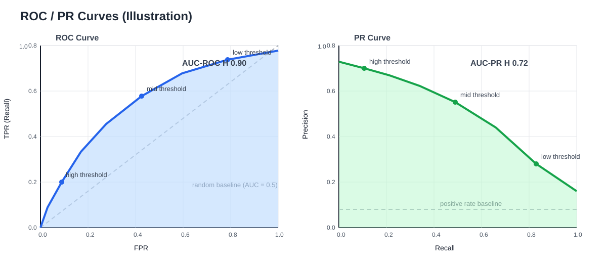

# 第二章：数学回顾与评估方法（整理笔记）

> 课程：模式识别与计算机视觉（PRCV）  
> 对应讲义：`2_数学回顾_评估方法.pdf`  
> 重点：泛化误差、正则化、不平衡学习、AUC/F1、贝叶斯决策、偏置-方差分解

---

## 1. 评估框架与泛化误差

机器学习任务可抽象为映射：

$$
f:\mathcal{X}\to\mathcal{Y}
$$

常见流程：

```text
获取数据 → 提取特征 → 进行学习 → 评价评估 → 实际应用
```

### 1.1 泛化误差（Generalization Error）

定义：模型在真实数据分布上的期望判错率。

$$
\mathbb{E}_{(\mathbf{x},y)\sim p(\mathbf{x},y)}\left[\mathbf{1}\!\left(f(\mathbf{x})\neq y\right)\right]
=
\mathbb{P}_{(\mathbf{x},y)\sim p(\mathbf{x},y)}\!\left(f(\mathbf{x})\neq y\right)
$$

- $(\mathbf{x},y)$：输入与真实标签
- $p(\mathbf{x},y)$：真实世界中的联合分布
- $\mathbf{1}(\cdot)$：指示函数，错分为 1、正确为 0

准确率与其互补：

$$
\text{acc}=1-\text{generalization error}
$$

### 1.2 $p(\mathbf{x},y)$ 是什么

$p(\mathbf{x},y)$ 是联合概率分布，描述“什么输入会出现、对应什么标签”。

$$
p(\mathbf{x},y)=p(y\mid \mathbf{x})\,p(\mathbf{x})
$$

- $p(\mathbf{x})$：输入分布
- $p(y\mid\mathbf{x})$：给定输入后的类别分布

### 1.3 为什么泛化误差通常算不出来

1. 真实分布 $p(\mathbf{x},y)$ 通常未知  
2. 输入空间高维，无法穷举积分/求和

因此用测试误差估计：

$$
\text{err}_{test}
=
\frac{1}{n}\sum_{i=1}^{n}\mathbf{1}\!\left(f(\mathbf{x}_i)\neq y_i\right),\quad (\mathbf{x}_i,y_i)\in D_{test}
$$

前提是假设 $D_{train}$ 与 $D_{test}$ 都由同一真实分布独立采样。

---

## 2. 过拟合与正则化

### 2.1 经验风险最小化

0-1 损失下：

$$
\min_f\ \frac{1}{n}\sum_{i=1}^{n}\mathbf{1}\!\left(f(\mathbf{x}_i)\neq y_i\right)
$$

但 0-1 损失不可导，常换成可优化替代损失（平方损失、log loss、hinge loss 等）。

### 2.2 欠拟合与过拟合

- 欠拟合：模型太简单，训练误差和测试误差都高
- 过拟合：模型太复杂，训练误差低、测试误差高

### 2.3 正则化如何降低复杂度

统一形式：

$$
\min_f\ \underbrace{\frac{1}{n}\sum_i L\!\left(f(\mathbf{x}_i),y_i\right)}_{\text{拟合项}}
\ +\
\underbrace{\lambda\,\Omega(f)}_{\text{复杂度惩罚}}
$$

- $\lambda$ 越大，惩罚越强，模型越“保守”
- 本质上是用少量偏差换取更低方差，改善泛化

常见形式：

- L2：$\Omega(f)=\lVert w\rVert_2^2$（权重缩小，曲线更平滑）
- L1：$\Omega(f)=\lVert w\rVert_1$（产生稀疏解，等价部分特征选择）
- 神经网络里的 `weight decay` 本质也是 L2 正则

---

## 3. 数据少时怎么评估：交叉验证

当没有独立测试集时，用 $N$ 折交叉验证（常用 $N=5$ 或 $10$）：

1. 把数据划分为 $N$ 份  
2. 每次取 1 份作验证，其余 $N-1$ 份训练  
3. 得到每折误差 $\text{err}_i$  
4. 取平均

$$
\text{CV error}=\frac{1}{N}\sum_{i=1}^{N}\text{err}_i
$$

---

## 4. 类别不平衡与代价不平衡

### 4.1 两种“不平衡”

1. **数据不平衡**：正负样本数量悬殊（如筛查中阴性远多于阳性）  
2. **代价不平衡**：不同错误后果不同（如漏诊代价远高于误诊）

### 4.2 为什么 Accuracy 会失真

若阳性仅占 1%，模型始终预测阴性也可能有约 99% 的 ACC，但几乎没有实际价值。

所以不平衡场景要重点看 Precision、Recall、F1、AUC-ROC、AUC-PR。

---

## 5. 混淆矩阵与核心指标

```text
                    预测 Positive   预测 Negative
真实 Positive          TP              FN
真实 Negative          FP              TN
```

定义：

$$
P=TP+FN,\qquad N=FP+TN
$$

核心指标：

- Precision（查准率）

$$
\text{PRE}=\frac{TP}{TP+FP}
$$

- Recall（查全率，等于 TPR）

$$
\text{REC}=\frac{TP}{P}=\frac{TP}{TP+FN}
$$

- FPR

$$
\text{FPR}=\frac{FP}{N}
$$

- FNR

$$
\text{FNR}=\frac{FN}{P}
$$

---

## 6. F1 为什么这样定义

F1 是 Precision 和 Recall 的调和平均：

$$
F_1=\frac{2\cdot \text{PRE}\cdot \text{REC}}{\text{PRE}+\text{REC}}
$$

调和平均会“惩罚短板”，只要 PRE 或 REC 很低，F1 就会明显下降。

将 PRE、REC 代入可得：

$$
F_1=\frac{2TP}{2TP+FP+FN}
$$

---

## 7. AUC-ROC 与 AUC-PR

下图把 ROC 和 PR 放在同一张图里，便于对比理解（左 ROC，右 PR）：



读图要点：

- **阈值从高到低**：通常会让 Recall 上升，同时也会引入更多 FP。
- **ROC 图（左）**：看曲线是否尽量靠近左上角；灰色对角线是随机分类器。
- **PR 图（右）**：看高 Recall 下还能否保持较高 Precision；类别极不平衡时更有参考意义。
- **AUC 本质**：都是“跨阈值总体表现”的面积指标，不依赖单一阈值。

### 7.1 ROC 与 AUC-ROC

ROC 曲线以不同阈值扫描得到：

- 横轴：$FPR=\dfrac{FP}{N}$
- 纵轴：$TPR=\dfrac{TP}{P}$

AUC-ROC 是 ROC 曲线下面积：

- AUC = 1：完美
- AUC = 0.5：随机猜测
- 对角线对应随机模型

它衡量模型的整体排序能力，且不依赖单一阈值。

### 7.2 PR 与 AUC-PR

PR 曲线坐标：

- 横轴：Recall
- 纵轴：Precision

AUC-PR 是 PR 曲线面积。  
在极度不平衡任务中，AUC-PR 往往比 AUC-ROC 更有判别力。

---

## 8. 贝叶斯框架：能 100% 准确吗

### 8.1 先验、类条件、后验

- 先验：$p(y=i)$  
- 类条件：$p(\mathbf{x}\mid y=i)$  
- 后验：$p(y=i\mid\mathbf{x})$

贝叶斯公式：

$$
p(y=i\mid\mathbf{x})
=
\frac{p(\mathbf{x}\mid y=i)\,p(y=i)}{p(\mathbf{x})}
$$

其中

$$
p(\mathbf{x})=\sum_{k=1}^{m}p(\mathbf{x}\mid y=k)\,p(y=k)
$$

### 8.2 代价矩阵与风险

$\lambda_{ij}$：真实类别为 $i$、预测为 $j$ 的代价。  
0-1 代价（二分类）常写为：

$$
\Lambda=
\begin{pmatrix}
0 & 1\\
1 & 0
\end{pmatrix}
$$

总体风险：

$$
R(f)=\mathbb{E}_{(\mathbf{x},y)}\!\left[\lambda_{y,f(\mathbf{x})}\right]
$$

在 0-1 代价下，风险就是错误率。

### 8.3 贝叶斯决策规则

对每个 $\mathbf{x}$，选期望代价最小的类别：

$$
f^*(\mathbf{x})
=
\arg\min_j \sum_{i=1}^{m}\lambda_{ij}\,p(y=i\mid\mathbf{x})
$$

0-1 代价时等价于选后验最大的类别：

$$
f^*(\mathbf{x})=\arg\max_i p(y=i\mid\mathbf{x})
$$

定义贝叶斯风险：

$$
R^*=\min_f R(f)
$$

它是理论可达的最小误差，所以理论最高准确率为：

$$
1-R^*
$$

因此一般不能保证 100% 准确，除非类别分布完全可分且无噪声。

---

## 9. Ground Truth 与误差来源

Ground Truth 常由人工标注给出，可能存在：

- 标注偏差（疲劳、标准不一致）
- 标注噪声（人也不确定）
- 高时间与经济成本

输出形式包括：

- 分类：离散标签
- 回归：连续值
- 结构化输出：如分词、序列标注

---

## 10. 偏置-方差分解（回归）

设真实函数为 $F(\mathbf{x})$，模型为 $f(\mathbf{x};D)$，随机性仅来自训练集 $D$。

$$
\mathbb{E}_D\!\left[\left(f(\mathbf{x};D)-F(\mathbf{x})\right)^2\right]
=
\underbrace{\left(\mathbb{E}_D[f(\mathbf{x};D)]-F(\mathbf{x})\right)^2}_{\text{Bias}^2}
+
\underbrace{\mathbb{E}_D\!\left[\left(f(\mathbf{x};D)-\mathbb{E}_D[f(\mathbf{x};D)]\right)^2\right]}_{\text{Variance}}
$$

简写 $\bar f=\mathbb{E}_D[f]$：

$$
\mathbb{E}\!\left[(f-F)^2\right]
=
(\bar f-F)^2+\mathbb{E}\!\left[(f-\bar f)^2\right]
$$

推导关键：在 $f-F$ 中加减 $\bar f$，展开平方后交叉项期望为 0。

若观测含噪声 $y=F(\mathbf{x})+\varepsilon$，则：

$$
\text{总误差}=\text{Bias}^2+\text{Variance}+\text{Noise}
$$

---

## 11. 统计检验（为什么需要）

单次测试结果会受抽样波动影响。  
统计检验用于判断模型差异是否“显著”，而非偶然。

建议掌握：

- 置信区间/置信度的意义
- T 检验的基本流程（设原假设、计算统计量、看 p-value）

---

## 12. 公式速查

- 泛化误差：

$$
\mathbb{E}_{(\mathbf{x},y)\sim p}\!\left[\mathbf{1}(f(\mathbf{x})\neq y)\right]
$$

- 测试误差：

$$
\frac{1}{n}\sum_{i=1}^{n}\mathbf{1}(f(\mathbf{x}_i)\neq y_i)
$$

- Precision / Recall：

$$
\text{PRE}=\frac{TP}{TP+FP},\qquad
\text{REC}=\frac{TP}{TP+FN}
$$

- F1：

$$
F_1=\frac{2\cdot \text{PRE}\cdot \text{REC}}{\text{PRE}+\text{REC}}
=
\frac{2TP}{2TP+FP+FN}
$$

- 贝叶斯后验：

$$
p(y\mid\mathbf{x})\propto p(\mathbf{x}\mid y)\,p(y)
$$

- 偏置-方差：

$$
\mathbb{E}\!\left[(f-F)^2\right]
=
\left(\mathbb{E}[f]-F\right)^2+\operatorname{Var}(f)
$$

---

*注：本版已统一为常见 Markdown 数学语法（`$...$` 与 `$$...$$`），通常可在 VS Code / Typora / Obsidian / Jupyter 等环境正常渲染。*
