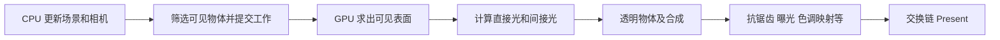
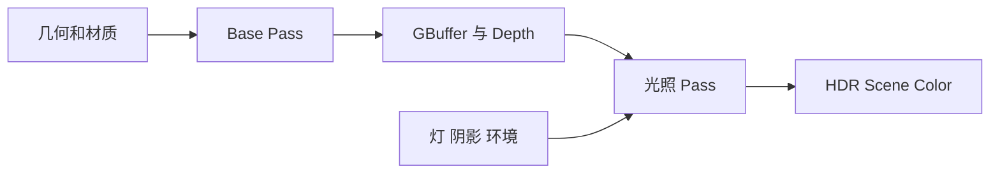
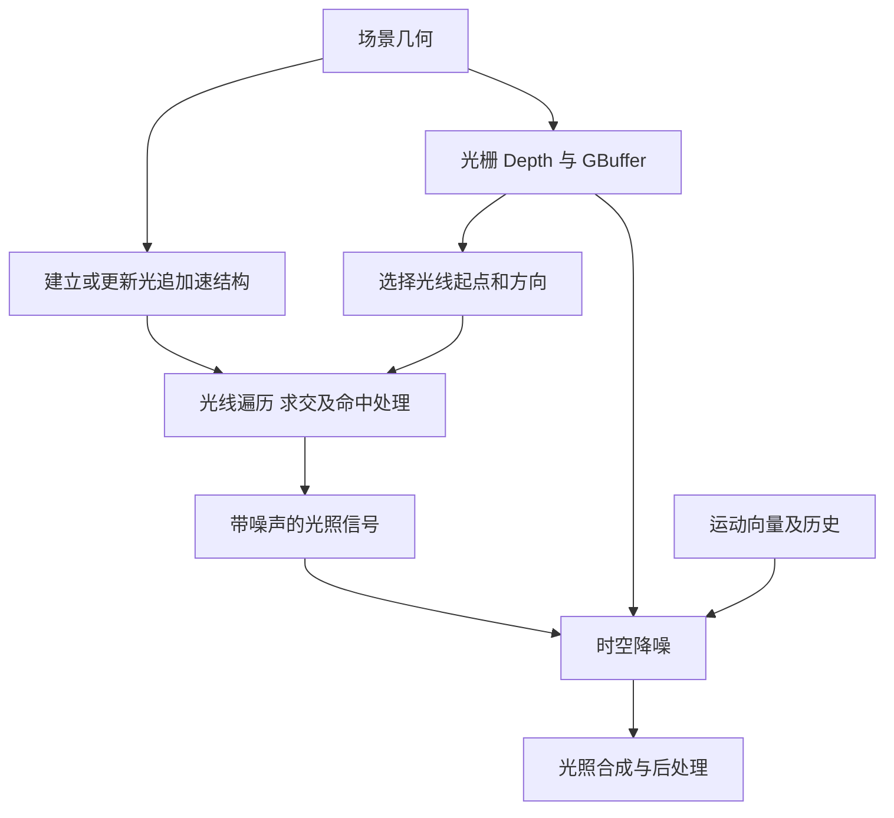
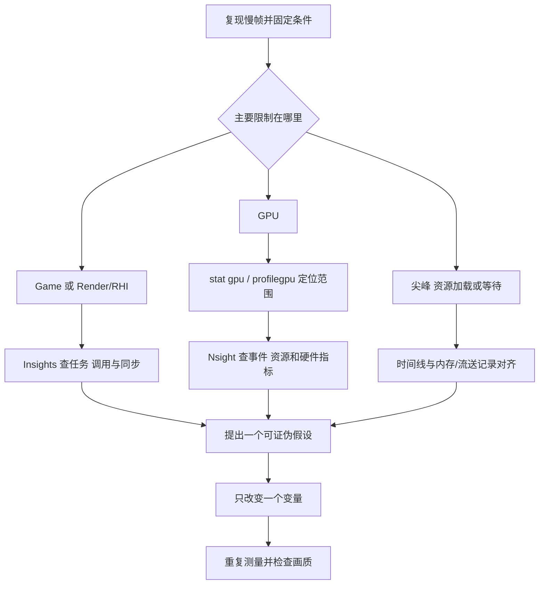

# 渲染研发新人入门：从一帧图像到性能分析

> 面向：会基本编程、图形学知识尚未建立或需要重新捡起的研发新人。  
> 主线：UE4 桌面延迟渲染 → 混合光追 → 光照与采样 → 性能分析 → D5 实现核验。  
> 资料核验日期：2026-09-17。UE 部分尽量固定到 4.27；UE5 Nanite、Lumen 单独说明。  
> 本文是教程与实验指南，不是已执行的 D5 场景性能报告。没有提供实际场景、产品版本和抓帧数据，因此不填写真实性能结论。

## 如何使用这份教程

每次学习按四步进行：**读懂一个概念 → 自己解释一个例子 → 完成一个实验 → 不看答案回答问题**。公式第一次看不懂没有关系，先读它前后的中文解释；第二遍再看符号；第三遍用数值算一遍。

建议安排 4～6 周、约 30～45 小时；这是练习安排，不是掌握程度的保证。已有基础可以跳过相应章节，但保留实验和自测。

| 阶段 | 阅读内容 | 必须交付的小成果 |
|---|---|---|
| 第 1 周 | 第 0～3 章：像素、变换、一帧、光栅与 GBuffer | 一张自己画的帧流程图，三张缓冲区截图 |
| 第 2 周 | 第 4～5 章：混合光追、BRDF、渲染方程 | 六种光照效果对照记录，解释一个球为什么亮 |
| 第 3 周 | 第 6～8 章：采样、噪声、多光源 | 算完三个采样例子，完成一组多光源对照 |
| 第 4 周 | 第 9～10 章：UE 与 Nsight 工具 | 一份抓帧记录、一组内存快照、一个单变量实验 |
| 第 5～6 周 | 第 11～12 章：D5 核验和复杂场景报告 | 填完实现核验表，提交可复现的性能报告 |

**第一次坐下来只做这一件事：**读第 0～1 章，建立“场景 → 可见表面 → 光照 → 屏幕”的关系，再做实验 A。不要从背 Pass 名字开始。

### 阅读导航

- [0. 最少的数学和图形学词汇](#chapter-0)
- [1. 一帧图像怎么产生](#chapter-1)
- [2. 光栅化、软硬光栅与 Nanite](#chapter-2)
- [3. 前向、延迟与 GBuffer](#chapter-3)
- [4. 混合光追与六类效果](#chapter-4)
- [5. BRDF、PBR 与渲染方程](#chapter-5)
- [6. 蒙特卡洛、重要性采样与 MIS](#chapter-6)
- [7. 光线追踪、噪声与降噪](#chapter-7)
- [8. 如何渲染多光源场景](#chapter-8)
- [9. 用 UE 工具判断问题](#chapter-9)
- [10. 用 Nsight 从 Pass 追到瓶颈](#chapter-10)
- [11. 把通用知识落实到 D5](#chapter-11)
- [12. 复杂场景实战和结业标准](#chapter-12)
- [附录 A：自测答案](#answers)
- [附录 B：资料与复习路线](#sources)

<a id="chapter-0"></a>
## 0. 最少的数学和图形学词汇

### 0.1 渲染究竟在算什么

假设你站在一个房间里，面前有一张桌子。屏幕需要回答：**沿着相机朝向某个像素的方向，能看见什么，以及那里有多亮、是什么颜色？**

这可以拆成三个问题：

1. **几何与可见性：**这个方向最先遇到桌子、墙还是天空？
2. **着色与光传输：**灯和天空怎样照到这个表面，表面又怎样把光送向相机？
3. **图像形成与显示：**怎样把计算结果转成可显示的像素，处理锯齿、曝光、色调和运动？

光栅化、光线追踪主要提供查询可见性的方法；BRDF 描述表面反射规律；采样方法帮助我们在有限时间内估计光照；后处理把这些结果组织成最终图像。它们解决的是不同层次的问题。

### 0.2 先认识八个词

| 词 | 通俗含义 | 别混淆成 |
|---|---|---|
| 顶点 Vertex | 网格上携带位置、法线、UV 等数据的点 | 屏幕像素 |
| 三角形 Triangle | 通常用于表示表面的基本图元 | 一个固定大小的屏幕区域 |
| 像素 Pixel | 图像中的一个位置；实际显示结果来自采样与重建 | 一根唯一的光线 |
| 片段 Fragment | 三角形覆盖屏幕后产生的候选处理项 | 一定会写进最终图像的像素 |
| 法线 Normal | 表面的朝向 | 表面位置或相机方向 |
| Shader | GPU 上执行的程序，例如顶点、像素、计算着色器 | 只负责“调颜色”的脚本 |
| Pass | 一组有特定输入、输出和目的的渲染工作 | 一次 Draw Call |
| Render Target | 用来接收渲染结果的纹理或图像资源 | 必然是最终彩色画面 |

一个 Pass 可以包含很多 Draw、Dispatch，甚至多个内部阶段。**RenderGraph** 管理 Pass 之间的读写依赖、资源生命周期和同步；**GPU 图形管线**描述一次图形绘制里顶点、光栅、着色等工作。二者不是同一个“管线”。

### 0.3 向量、点乘、矩阵只学到能用

向量既可以表示位移，也可以表示方向。长度为 1 的向量叫单位向量。计算光照时通常先归一化方向。

两个单位向量的点乘满足：

$$\mathbf a\cdot\mathbf b=\cos\theta$$

同向为 1，垂直为 0，反向为 -1。因此 `max(dot(n,l),0)` 表示表面朝向光源的程度：正对时亮，侧着时暗，背着时不接受该侧的直接照明。

矩阵可以理解成统一描述旋转、缩放、平移、投影的一套规则。点常写成 `(x,y,z,1)`，方向常写成 `(x,y,z,0)`。最后一项让平移影响点的位置，而不改变方向。

采用列向量约定时：

$$p_{clip}=PVMp_{local}$$

- `M`：模型到世界。例如把一把原点处的椅子放到房间角落。
- `V`：世界到相机坐标。把观察位置当作新的参照。
- `P`：投影到裁剪空间。透视投影使远处物体看起来更小。
- 随后先做必要裁剪，再除以 `w`，得到 NDC；最后映射到视口像素。

引擎可能采用不同矩阵存储方式或乘法约定，代码顺序不能只靠这一个式子机械判断。

### 0.4 颜色值不等于光能，亮度也不等于材质颜色

白墙在阴影里可以看起来很暗，但白墙的反射属性没有因此变成黑色。材质的 Base Color 与最终画面颜色是两件事。

光照相加和大部分滤波应在适当的**线性空间**中进行；sRGB 是常见的显示/存储编码。法线、粗糙度、金属度等数据贴图不是普通颜色，一般不能错误地按 sRGB 颜色解码。

HDR 光照结果可以超过 1。曝光与色调映射会把较大动态范围映射到目标显示范围。所以“画面变亮了”也可能只是自动曝光发生了变化。后面的对照实验必须固定曝光。

<a id="chapter-1"></a>
## 1. 一帧图像怎么产生

### 1.1 用同一个房间贯穿教程

准备一个练习场景：白墙和地板、红色漫反射球、金属球、玻璃球、一扇窗、窗外天空、一盏面积灯和一块遮挡板。以后改变一个条件，就看哪些结果变化。

先把整体流程记成：



这是概念依赖图，不是所有 UE/D5 版本唯一的执行顺序。阴影生成、加速结构更新、异步计算可能穿插或重叠。

### 1.2 CPU 和 GPU 分别在做什么

CPU 更新对象、动画、相机和资源，准备或调度渲染工作。GPU 根据命令处理大量顶点、像素和光线查询。

UE 的 Game Thread、Render Thread、RHI Thread 与 GPU 可以流水并行，甚至处理不同帧。因此不能简单把四个耗时相加当作帧时间。

在排除限帧和等待、且流水稳定时，可以把下式当作粗略直觉：

$$T_{frame}\approx\max(T_{game},T_{render/RHI},T_{GPU})$$

实际还会受同步、任务依赖、Present、驱动、资源上传影响。这不是精确恒等式，更不是输入延迟的公式。

例子：CPU 准备约 7 ms、GPU 工作约 20 ms，此时优先调查 GPU；GPU 降到 5 ms 后，CPU 可能成为新的限制。单独优化一个线程，帧率不一定随之增长。

### 1.3 GPU 怎样把桌子变成候选像素

1. **读取网格和顶点变换。**把局部坐标中的桌子变换到相机和投影空间；骨骼、顶点形变也可能在相关阶段执行。
2. **图元组装与裁剪。**把顶点组成三角形，对视锥边界裁剪，按配置剔除背面。
3. **透视除法与视口映射。**计算屏幕上的三角形位置。
4. **覆盖测试。**判断三角形覆盖哪些采样点；这就是狭义光栅化的核心。
5. **插值。**把顶点属性传到片段。UV 等通常需要透视正确插值，不能直接照搬屏幕空间线性比例。
6. **深度与着色。**根据深度、模板和材质规则决定是否保留结果，并计算或记录材质信息。
7. **输出。**写入深度、GBuffer 或颜色，必要时做混合。

深度测试不是永远排在像素着色器之后。硬件可在允许时执行 Early-Z 等优化；透明、丢弃片段、写深度等行为会影响可用的早期剔除方式。[Microsoft 光栅阶段说明](https://learn.microsoft.com/en-us/windows/win32/direct3d11/d3d10-graphics-programming-guide-rasterizer-stage)

### 1.4 UE4 桌面延迟渲染的一组常见工作

| 工作 | 要解决的问题 | 常见输入 → 输出 |
|---|---|---|
| Visibility / Init Views | 哪些物体需要提交？ | 场景、相机、遮挡信息 → 可见集合 |
| Depth Prepass（按配置） | 尽早建立深度，减少后续浪费 | 几何 → 深度 |
| Base Pass | 当前可见表面有什么材质属性？ | 几何、材质 → GBuffer 等 |
| Shadow 相关工作 | 表面到灯是否被挡住？ | 几何/加速结构、灯 → 阴影信息 |
| Lighting | 材质如何响应灯光和环境？ | GBuffer、灯、阴影、环境 → HDR 光照 |
| AO / GI / Reflection | 接触遮蔽、间接照明、反射如何补全？ | 深度、法线、场景表示等 → 对应信号 |
| Translucency | 如何处理玻璃、半透明表面？ | 透明几何、背景、光照 → 透明结果 |
| Post Processing | 如何稳定采样并映射到显示？ | HDR 颜色、历史、运动等 → 最终图像 |
| UI / Present | 怎样显示到窗口？ | 场景图像、UI、交换链 → 屏幕 |

Base Pass 可能还涉及静态光照、速度等数据，具体输出受版本和配置影响。某些效果前置、合并、降分辨率执行，或者根本没有开启。**抓到实际一帧以后，应按资源读写关系还原，而不是要求帧事件和表格顺序完全一致。** UE4 对材质写 GBuffer、后续读取并计算光照的说明见 [Rendering Overview](https://dev.epicgames.com/documentation/unreal-engine/rendering-overview?application_version=4.27)。

### 实验 A：用三个视图建立直觉

1. 在 UE 练习项目中固定相机与曝光，等待着色器编译和资源加载完成。
2. 查看 Lit、Unlit、Buffer Visualization 中的 Base Color、World Normal、Scene Depth；具体菜单名以版本为准。
3. 只移动灯：最终明暗会变；物体不动时，Base Color、法线、深度应基本保持对应几何/材质含义。
4. 只移动相机：深度与可见表面变化；同一物体的材质定义不因此改变。
5. 保存最终颜色、法线、深度三张图，各写一句它能回答的问题。

**自测 1：**灯移动后桌面的明暗变了，为什么不需要重新建模桌子？GBuffer 里的哪些信息可以继续表达同一套材质属性？

<a id="chapter-2"></a>
## 2. 光栅化、软硬光栅与 Nanite

### 2.1 光栅化并不自动知道“灯有没有被挡住”

主相机光栅化告诉你：某个屏幕采样点上哪个三角形可见。它不会自动给出表面到另一盏灯之间有没有墙。因此还需要 Shadow Map、光线查询或其他可见性方法。

“没有光追就不能有阴影/反射/GI”也不成立。这些效果都可以用不同近似表示或预计算方法实现。区别在准确性、动态能力、场景表示和成本。

### 2.2 光栅相关开销主要在哪里

狭义光栅阶段的覆盖生成，与大家口头说的“光栅渲染总成本”应分开。后者还包含几何、着色、读写和提交。

| 成本 | 直觉 | 常见线索 | 优化方向与代价 |
|---|---|---|---|
| CPU 提交/场景遍历 | 每个对象都要安排工作 | Draw/RHI 时间高，GPU 有空洞 | 实例化、批处理、剔除；过度合并会损失剔除粒度 |
| 顶点/几何处理 | 大量顶点或复杂形变 | 深度/几何阶段重，降分辨率收益小 | LOD、减少无效顶点、简化形变；检查轮廓质量 |
| 三角形设置与覆盖 | 每个小三角形也有固定工作 | 微小、狭长三角形很多 | 改善拓扑和 LOD；不只是减少总面数 |
| Overdraw | 同一屏幕区域被多层覆盖 | 草木、粒子、透明叠层多 | 剔除、前到后绘制、合适的深度策略 |
| 像素着色 | 每个片段执行材质程序 | 复杂材质区域重 | 降低昂贵计算/采样；以实际 Shader 时间验证 |
| 纹理访问/带宽 | 反复搬运大量数据 | 大纹理、缓存不友好、带宽压力 | Mipmap、压缩、合理尺寸、减少冗余读写 |
| Render Target 写入 | 每个像素写多个附件 | 高分辨率、多 GBuffer、MSAA | 精度与格式取舍、减少中间资源；检查画质 |

**Overdraw** 强调重复覆盖或处理；**Overshading/Quad 浪费**还包括为导数等机制执行了没有有效输出的辅助像素工作。小三角形只覆盖 2×2 Quad 的一小部分时，效率可能很差。二者相关，但不是完全相同的指标。

纹理采样次数多不必然说明带宽受限，Shader 指令多也不必然说明算力受限。缓存命中、延迟隐藏、占用率、分支发散都会改变瓶颈，最终要看硬件证据。

### 2.3 先做一个像素预算估算

1920×1080 约 207 万像素；3840×2160 约 829 万像素，是 4 倍。假设一个教学用缓冲集合每像素合计写 16 字节，单次全屏写入约为：

- 1080p：33.18 MB；
- 4K：132.71 MB；
- 4K、每秒 60 次这样的写入：约 7.96 GB/s。

这是十进制单位、未计压缩/缓存等因素的算术估算，**不是 UE 固定 GBuffer 布局，也不是显存占用或实际带宽测量**。真实一帧通常有更多读写，也有压缩和缓存节省。

降低长宽各一半，像素数量变为四分之一；但几何处理、CPU、阴影图、加速结构等成本不一定跟着变。所以不能承诺帧率变四倍。

### 2.4 硬光栅与软光栅

| 比较 | 硬件光栅化 | 软件光栅化 |
|---|---|---|
| 谁完成覆盖规则 | GPU 专用固定功能单元 | 自己写的程序 |
| 在哪里运行 | GPU | 可以在 CPU，也可以在 GPU Compute Shader |
| 优点 | 通用图形绘制效率高，规则和硬件配合成熟 | 可针对特定几何与输出格式定制 |
| 代价 | 特殊工作负载可能不匹配硬件擅长的情况 | 自行处理覆盖、深度、并发写入等复杂问题 |

“软件”描述实现方式，并不意味着“在 CPU 上算”。同样，“硬件光栅”也不意味着材质计算全由固定功能电路完成，顶点与像素 Shader 仍是可编程的。

### 2.5 Nanite 应怎样回答

入门答案：**Nanite 是虚拟化几何系统，使用软硬件混合光栅路径；微小三角形可由 GPU 计算着色器的软件光栅器处理，较大三角形走硬件光栅。它不是一种路径追踪器。** 这一划分在 [Arm 对 Nanite 的实现分析](https://developer.arm.com/community/arm-community-blogs/b/mobile-graphics-and-gaming-blog/posts/mali-and-unreal-engine-s-nanite-enabling-the-future-of-mobile-graphics) 中有直接说明。

理解到下一层即可：几何被组织为层级簇，进行细粒度剔除和细节选择；可见性阶段记录“哪个三角形覆盖了这里”，随后执行材质工作。**Visibility Buffer 记录的可见图元信息，与 GBuffer 记录的表面材质属性不同。** 具体流程、可编程光栅功能和限制随 UE5 版本演进，参见 [Epic Nanite 文档](https://dev.epicgames.com/documentation/en-us/unreal-engine/nanite-virtualized-geometry-in-unreal-engine)。

不要背一个跨版本固定的大小阈值，也不要认为 Nanite 自动解决透明叠层、复杂材质、所有光照或全部光追成本。

### 实验 B：像素多，还是几何多

固定相机、LOD 条件、渲染模式和曝光，关闭动态分辨率/自动质量调整，记录基线。仅改变内部渲染比例，再恢复基线：

- 若 GPU 时间明显下降，说明存在较强的像素相关成本，但不能仅凭这一条定位到某个 Pass。
- 若变化小，继续检查 CPU、几何、固定分辨率 Pass、限帧与同步。
- 若启用了屏幕尺寸驱动的 LOD/Nanite，分辨率改变也可能改变几何选择，要记录这个干扰因素。

**自测 2：**十万个小三角形和十万个大三角形，能否仅按面数判断谁更快？软件光栅为什么也可能运行在显卡上？

<a id="chapter-3"></a>
## 3. 前向、延迟与 GBuffer

### 3.1 前向渲染：画这个表面时计算它的光照

概念流程：提交物体 → 得到片段 → 获取材质 → 计算相关光源 → 写颜色。

早期朴素实现可能让许多片段遍历许多灯，甚至反复绘制物体。现代 Forward+ / Clustered Forward 会先建立局部光源列表，避免每个像素遍历所有灯。

### 3.2 延迟渲染：先记下表面，再统一计算光照

第一阶段为可见不透明表面写入材质属性；第二阶段读取这些属性与深度，对相关像素计算光照。



“延迟”指推迟光照求值，不是故意晚显示一帧，也不是 UI 延迟。

### 3.3 GBuffer 存什么

可以把 GBuffer 看成“屏幕可见表面的属性表”，通常由多张纹理组成：

- Base Color 或与反射相关的颜色参数；
- 法线；
- 粗糙度、金属度、镜面反射参数；
- Shading Model 标识与某些模型的附加数据。

Depth 常是独立资源。根据深度、屏幕坐标和逆变换可以重建位置，不一定保存完整世界坐标。Velocity 常也是关联资源，并不表示一定是某个 GBuffer 通道。**精确到 GBufferA 的 R 通道是什么，必须查对应版本和配置。**

只保存一个可见表面，意味着它无法自然表达同一像素穿过的多层玻璃；透明通常需要另外的绘制或表示方式。

### 3.4 应怎样比较两者

| 方面 | 前向 | 延迟 |
|---|---|---|
| 光照时机 | 材质着色过程中 | 写入表面属性之后 |
| 中间数据 | 通常不需要完整传统 GBuffer | GBuffer 带来存储和带宽成本 |
| 多灯 | 依赖光源筛选；现代前向可高效处理 | 方便按屏幕/光体积计算，也需要筛选 |
| 透明 | 更自然地处理逐层着色与混合 | 常与额外前向透明路径结合 |
| 抗锯齿 | 常便于使用 MSAA | MSAA 的存储和光照处理更复杂 |
| 材质模型 | 每个材质可有较自由的着色流程 | 受 GBuffer 编码和光照分支约束 |
| 谁更快 | 取决于内容、硬件与功能 | 同样取决于内容、硬件与功能 |

不要背“前向只适合少光源、延迟一定更快”。UE4 的 Forward Renderer 本身会对光源和反射捕获进行局部筛选，其功能支持也与延迟路径不同。[Epic UE4 Forward Shading Renderer](https://dev.epicgames.com/documentation/en-us/unreal-engine/forward-shading-renderer?application_version=4.27)

### 实验 C：看懂属性如何变成颜色

固定灯和相机，只改变金属球的 Roughness：先记下 Base Color，再观察粗糙度可视化和最终反射。解释为什么“底色没变，但高光与倒影形态变了”。

如果要真正比较 Forward 与 Deferred 性能，应在实验项目副本中切换并等待必要重启/编译，统一功能、抗锯齿和输出质量。不能把“少开了几项功能”当作算法天然更快的证据。

**自测 3：**为什么延迟渲染仍然可能包含前向透明 Pass？GBuffer 中的 Base Color 能不能直接当作最终画面？

<a id="chapter-4"></a>
## 4. 混合光追与六类效果

### 4.1 Hybrid Ray Tracing 是怎样分工的

常见做法是：用光栅化高效找到相机直接看见的表面，再从这些表面出发，用光线查询补充阴影、环境可见性、间接光、反射或折射，之后降噪和合成。UE4 提供这类实时光追功能，详见 [UE4 Real-Time Ray Tracing](https://dev.epicgames.com/documentation/unreal-engine/real-time-ray-tracing?application_version=4.27)。



图是教学架构，不是 D5 当前产品帧图。实际实现可能混用屏幕空间、探针、缓存、光栅阴影或 RT，且多个功能可能共用一次追踪或降噪。

### 4.2 六类效果分别在问什么

原清单的 `AmbitionOcclusion` 应为 **Ambient Occlusion，环境光遮蔽，AO**。

| 名称 | 核心问题 | 常见光线/计算方式 | 常见输出 | 不应混淆成 |
|---|---|---|---|---|
| Shadow | 这个表面能看到某盏灯吗？ | 向灯或灯面采样点做有限距离可见性查询 | 可见性/阴影遮罩或直接光信号 | 完整 GI |
| Skylight | 天空或环境从哪些方向照进来？ | 对环境方向采样，查询遮挡，结合材质响应 | 环境光贡献或相关可见性 | 一定经过墙面反弹的光 |
| Global Illumination | 别的表面怎样把光反弹到这里？ | 查询间接方向，求命中处的入射/出射光，或使用缓存 | 间接光照 | 只有接触处变暗 |
| Ambient Occlusion | 周围半球在一定尺度内有多少被挡住？ | 近距离半球遮挡查询或屏幕空间近似 | 遮蔽/可见因子、可能有 Bent Normal | 有色光能传输 |
| RT Reflection | 沿镜面/粗糙反射方向能看到什么？ | 根据镜面 BRDF 采样，追踪并获得命中辐射 | 镜面反射辐射 | 把屏幕颜色简单翻转 |
| RT Translucency | 穿过玻璃后能看到什么、怎样衰减？ | 折射/透射与可能的反射分支、多个界面 | 透射颜色与透明合成结果 | Alpha 混合必然等同物理玻璃 |

这些名称是功能分类，不保证是六个独立、同名的 GPU Pass。GI 在不同团队的命名中可能仅指间接漫反射，也可能有更广含义；**先问清信号定义，再比较 Pass。**

### 4.3 Shadow：硬阴影为什么会变软

理想点光源只有一个方向：从表面到灯，要么遮挡，要么不遮挡。面积灯有大小：表面可能只看见灯的一部分，于是出现半影。

Shadow Map 从灯的视角记录深度，再比较着色点是否处于遮挡物之后；光追阴影直接查询表面到灯的路径。两者都要处理精度、自相交和过滤问题。面积光追阴影采样少会有噪声，阴影贴图也可能用过滤近似软边。

实验：只改变灯面尺寸。保持光能参数的定义一致，否则亮度也可能变化。观察接触附近与远离接触区域的阴影边缘，并分别记录噪声和成本。

### 4.4 Skylight、AO、GI 为什么最容易混

开着窗的房间里，墙能直接看到一部分天空，这是环境照明的可见性问题。天空照亮红球后，红球把红色光反弹到白墙，这是间接照明。桌角附近被几何包围，环境可见方向减少，AO 可以近似这种局部遮蔽。

用一个简化的余弦加权定义说明 AO。设 `V_R(ω)` 为在半径 R 内方向 ω 是否无遮挡：

$$A(x)=\frac{1}{\pi}\int_{\Omega^+}V_R(x,\omega)(n\cdot\omega)d\omega$$

这里 `A=1` 代表完全无遮挡，有的实现把 `1-A` 称作 AO，也有不同权重和衰减定义。它没有像真实光照积分一样考虑每个方向实际光亮和材质颜色，因而不能完整生成红球的颜色溢出。

已经正确计算的间接照明若再无条件乘很强 AO，可能重复压暗。AO 应接入哪个信号，是具体管线的合成问题。

### 4.5 Reflection 与 Translucency 的区别

镜子把视线反射到别处；玻璃让一部分光反射、一部分光穿过并折射。粗糙表面的微观法线分布让反射方向扩散，因此倒影模糊。玻璃还可能发生吸收、多界面折射和全内反射。

SSR 只能利用屏幕中已有的信息，屏幕外、被遮住的物体可能缺失；RT 可以查询光追场景表示中的屏幕外物体，但仍受加速结构、几何表示、材质支持和最大距离等限制。

**主相机看不见的对象，仍可能出现在镜子里、产生阴影或贡献 GI。**因此主视图剔除不能直接套用到光追场景。

### 实验 D：一项一项拆光照

| 只改变这一项 | 主要观察什么 | 用来区分什么 |
|---|---|---|
| 在灯和球之间放遮挡板 | 直接照明与投影区域 | 阴影与材质底色 |
| 关闭灯，保留天空 | 窗口与房间受光 | 环境照明与局部灯光 |
| 红球靠近白墙 | 墙上是否出现红色反弹光 | GI 与 AO |
| 增大粗糙度 | 镜面信号形态与噪声 | BRDF 与采样 |
| 把物体移到镜子可见、相机不可见处 | 反射是否还包含它 | 屏幕空间与场景空间查询 |
| 增加玻璃层数 | 透射结果、误差和耗时 | 透明合成与多界面传输 |

根据实际项目支持的开关操作，不复制不明含义的 D5 私有命令。每次实验固定曝光，等待历史稳定，再检查移动时表现。

**自测 4：**白墙被红球染红，应该首先想到 AO、阴影还是 GI？“Skylight 是不是光追”为什么不能只凭名字判断？

<a id="chapter-5"></a>
## 5. BRDF、PBR 与渲染方程

### 5.1 先分清光与材质各自负责什么

同一盏灯照到白纸和镜子上，会得到完全不同的外观。灯提供入射光，材质决定光朝哪个方向反射，几何决定方向关系与遮挡。

使用方向约定：`n` 为单位法线，`l` 指向光源，`v` 指向观察者，均从表面向外。`h=normalize(l+v)` 是半程向量。`ωi` 表示指向入射光来源的方向，`ωo` 表示朝观察者的出射方向。

### 5.2 Blinn–Phong：先用一个易懂的模型建立直觉

一种常见的教学形式是：

$$C=k_aC_a+C_L\left[k_d\max(n\cdot l,0)+k_s\max(n\cdot h,0)^s\right]$$

暂时省略距离衰减和可见性，并对无效入射/出射方向做适当处理。

- 第一项是经验环境底色，不能理解成真实 GI。
- 漫反射项：越正对光源越亮。
- 高光项：越接近合适的镜面方向越亮。
- 指数 `s` 越大，高光通常越集中。

优点是简单直观；传统经验形式通常没有严格处理归一化、能量守恒和 Fresnel 等问题。但不能说所有 Phong/Blinn–Phong 变体都必然不守恒，也不要把这个示意公式当成所有引擎的实际代码。

### 5.3 BRDF：描述方向之间的反射关系

BRDF 全称是双向反射分布函数：

$$f_r(x,\omega_i,\omega_o)=\frac{dL_o(x,\omega_o)}{dE_i(x,\omega_i)}$$

直觉：从一个方向照来一点光，这个表面会向另一个方向送出多少光？它是材质与方向的函数，**不是一个 RGB 贴图，也不是一个必须落在 0～1 的概率**。

先认识三个物理量：

| 量 | 在回答什么 | 单位 |
|---|---|---|
| 辐射通量 Φ | 总共有多少辐射功率 | W |
| 辐照度 E | 每单位面积收到多少功率 | W/m² |
| 辐射亮度 L | 沿某方向、按投影面积与立体角计有多亮 | W/(m²·sr) |

BRDF 的单位是 `sr⁻¹`。立体角 `dω` 可以理解成方向空间中的一小块面积；半球的立体角为 `2π sr`。[PBRT 辐射度量学](https://pbr-book.org/4ed/Radiometry,_Spectra,_and_Color/Radiometry)

理想反射模型通常关注非负性、能量守恒，以及适用条件下的互易性。**BRDF 某个方向上的值可以大于 1，约束的是对方向积分后的能量，而不是逐点数值上限。**

BRDF 只描述反射；BTDF 描述透射；BSDF 是更广义的表面散射描述，包含反射与透射。[PBRT BSDF Representation](https://pbr-book.org/4ed/Reflection_Models/BSDF_Representation)

### 5.4 Lambert 漫反射为什么要除以 π

理想 Lambert 表面的 BRDF 为：

$$f_r=\frac{\rho}{\pi}$$

其中 `ρ` 是漫反射率，每个颜色通道在被动材质条件下处于合理的 0～1 范围。除以 π 是因为：

$$\int_{\Omega^+}\cos\theta\,d\omega=\pi$$

这个归一化使反射总能量与反射率对应。“漫反射看起来与观察方向无关”不等于“照明与光源方向无关”，入射仍有余弦投影项。

### 5.5 PBR 是建模方法，不是一个单独公式

PBR 强调使用有物理依据的材质、光照和能量关系，建立在一致单位、线性计算等实践上。它既可以用于光栅渲染，也可以用于路径追踪。

UE 常见的金属度工作流提供 Base Color、Metallic、Roughness、Specular 等输入：[Epic Physically Based Materials](https://dev.epicgames.com/documentation/en-us/unreal-engine/physically-based-materials?application_version=4.27)。

| 参数 | 主要改变什么 | 容易误解之处 |
|---|---|---|
| Base Color | 非金属的漫反射颜色；金属中与镜面反射颜色相关 | 不应烘进真实灯光阴影 |
| Metallic | 常见模型中在非金属/金属响应间组织参数 | 不是普通“高光强度”滑条 |
| Roughness | 微表面朝向分布，影响高光和反射扩散 | 不只是给反射贴一层模糊 |
| Specular | UE 工作流中参与非金属 F0 等参数化 | 不是关闭所有反射的通用开关 |
| Normal | 改变用于着色的表面方向 | 不等于真正增加轮廓几何 |

纯金属通常没有普通非金属式的漫反射分量，且镜面反射可以有颜色。实际资产上的中间金属度可能来自混合覆盖等情况，不能机械禁止所有中间值。

### 5.6 微表面模型：只需先认识 D、F、G

把粗糙表面想象成很多朝向不同的小镜面。一类常见镜面 BRDF 写成：

$$f_s(l,v)=\frac{D(h)F(v,h)G(l,v)}{4\max(n\cdot l,0)\max(n\cdot v,0)}$$

该表达式用于有效的上半球方向；实际实现需要稳定地处理掠射、零分母和光滑极限。

- **D：**有多少微表面朝向适合完成这次反射？GGX 是常用分布之一。
- **F：**单个界面会反射多少光？非金属越接近掠射，通常反射越强，这就是常见 Fresnel 现象。
- **G：**微表面之间的遮蔽与掩蔽，会挡掉多少原本可能的贡献？

教学中可把总 BRDF 看成漫反射与微表面镜面之和，但必须考虑能量分配。不能把两个任意大小的项无条件相加。粗糙度如何映射到分布参数、是否补偿微表面多次散射，都取决于具体实现。[PBRT 微表面理论](https://pbr-book.org/4ed/Reflection_Models/Roughness_Using_Microfacet_Theory)

### 5.7 渲染方程：把所有入射方向的贡献加起来

对无透射的表面，可以写成：

$$L_o(x,\omega_o)=L_e(x,\omega_o)+\int_{\Omega^+}f_r(x,\omega_i,\omega_o)L_i(x,\omega_i)\max(n\cdot\omega_i,0)d\omega_i$$

逐项读成一句话：**朝相机出去的光 = 表面自己发出的光 + 从整个上半球照来的光，经过材质响应与投影权重后累加。**

| 符号 | 含义 |
|---|---|
| `x` | 当前表面位置 |
| `Lo` | 从 x 朝观察方向出去的辐射亮度 |
| `Le` | 表面自身发光 |
| `Li` | 从某方向实际到达 x 的辐射亮度 |
| `fr` | 材质对入射与出射方向的反射响应 |
| `max(n·ωi,0)` | 入射方向对应的投影权重 |
| `∫ dωi` | 连续地累加所有入射方向 |

上述 `Li` 已表示真正到达表面的光，包含路径遮挡的影响；若改写为显式采样光源的形式，通常会把可见性 `V` 单独乘入。不要在两种定义之间重复计算遮挡。

递归关系在哪里？若入射方向命中另一面墙，当前点的 `Li` 来自那面墙的 `Lo`。因此光照会在表面间传播。[PBRT Light Transport Equation](https://pbr-book.org/4ed/Light_Transport_I_Surface_Reflection/The_Light_Transport_Equation)

### 5.8 手算一个能检查程序的例子

假设上半球每个方向都有相同亮度 `Li=2`，表面无遮挡、无自发光、为 `ρ=0.6` 的 Lambert 材质：

$$L_o=\frac{0.6}{\pi}\times2\times\pi=1.2$$

这里没有写“除以距离平方”。真空中沿同一光线传播的辐射亮度保持不变；熟悉的平方反比出现在点光源辐照度、几何投影或采样测度转换等关系里，不能随意把每个 `Li` 再乘一次 `1/r²`。

**自测 5：**PBR 是否必须开光追？为什么 Lambert 要有 `1/π`？白色物体在暗处看起来黑，说明 Base Color 变黑了吗？

<a id="chapter-6"></a>
## 6. 蒙特卡洛、重要性采样与 MIS

### 6.1 为什么不能把渲染方程直接算完

方向有无穷多个，每个方向还可能命中新的表面。真实场景中的遮挡、纹理和复杂材质也让解析积分非常困难。我们只能在有限预算内选一些方向，估计总和。

蒙特卡洛积分就是用随机样本估计积分。随机不是目的，**把有限工作量变成可分析的估计误差**才是关键。

### 6.2 先看一维积分，不急着追光线

要求：

$$I=\int_0^1 2x\,dx=1$$

在 `[0,1]` 均匀抽取 `N` 个 `x`，取 `2x` 的平均，就能估计结果。例如四个教学样本 `0.1、0.3、0.6、0.9` 给出：

$$\hat I=(0.2+0.6+1.2+1.8)/4=0.95$$

一次得到 0.95 没有否定正确性，也不代表以后每次增加样本都单调更接近 1。随机估计围绕真值波动。

若采样的概率密度为 `p(x)`，一般形式是：

$$\hat I=\frac1N\sum_{k=1}^{N}\frac{f(X_k)}{p(X_k)},\quad X_k\sim p$$

为什么要除以 `p`？常被抽到的位置已经被偏爱，必须减小其单次权重；很少抽到的位置则需要更大的权重。只改变抽样频率而不补偿，会改变你估计的积分。

概率密度不是“抽中某个精确连续点的概率”，其积分才是概率，密度本身可以大于 1。`p` 的定义域必须覆盖所有可能有非零贡献的部分，除非由其他采样策略覆盖并正确组合。[PBRT Monte Carlo Basics](https://pbr-book.org/4ed/Monte_Carlo_Integration/Monte_Carlo_Basics)

### 6.3 重要性采样：把样本放到更可能有贡献的地方

还是积分 `f(x)=2x`，选 `p(x)=2x`，每次非零样本都给出：

$$f(x)/p(x)=1$$

这个理想例子中方差为零。可以用均匀随机数 `u` 令 `x=√u` 生成该分布。真实光照里不知道完整被积函数，特别是不知道遮挡，因此通常只能近似匹配。

常见选择包括：按 BRDF 采样、按灯光亮度和位置采样、按环境贴图亮区采样。重要性采样优化的是方差与时间，不是自动让每条光线变便宜。[PBRT Improving Efficiency](https://pbr-book.org/4ed/Monte_Carlo_Integration/Improving_Efficiency)

### 6.4 从一维回到半球：一个很有用的抵消

在均匀半球采样下，`p(ω)=1/(2π)`。对 Lambert 表面，一个样本贡献为：

$$\frac{(\rho/\pi)L_i\cos\theta}{1/(2\pi)}=2\rho L_i\cos\theta$$

若使用余弦加权半球采样，`p(ω)=cosθ/π`，则贡献为：

$$\frac{(\rho/\pi)L_i\cos\theta}{\cos\theta/\pi}=\rho L_i$$

边界的零密度方向按数学与数值约定处理。在均匀环境这个理想例子里，它非常有效；但 `Li` 若是只有一小块极亮窗口，仍可能很难采中，因此不是“用了余弦采样就没有噪声”。

### 6.5 为什么一种策略不够

想象一个粗糙球上方有一盏很小、很亮的面积灯：

- 按 BRDF 采样：方向大多合理，但可能频繁错过小灯。
- 按灯面采样：经常采到灯，但当材质高光极窄时，许多方向并不符合主要反射方向。

MIS，即多重重要性采样，用多种策略生成样本，再按密度正确分配贡献。它不是“把光源和 BRDF 相乘当作概率”，也不是“两个结果随便平均一下”。

### 6.6 MIS 的公式与数值

采用多样本模型，策略 i 生成 `n_i` 个样本：

$$\hat I=\sum_i\frac1{n_i}\sum_{j=1}^{n_i}w_i(X_{i,j})\frac{f(X_{i,j})}{p_i(X_{i,j})}$$

一种常见 Power Heuristic（指数为 2）：

$$w_i(x)=\frac{(n_i p_i(x))^2}{\sum_k(n_kp_k(x))^2}$$

对一个给定方向，若两种策略各取一个样本，且该方向上的 `p_light=0.8`、`p_BRDF=0.2`，则：

- `w_light=0.64/(0.64+0.04)=16/17≈0.9412`；
- `w_BRDF=1/17≈0.0588`。

这是同一方向上的权重示例。每个实际生成的样本都要在**自己的方向**上同时求出相关 PDF，再计算权重。不能把这两个常数套到所有方向，也不能在已经按上述公式组合之后又额外除以策略数量。[PBRT MIS 推导](https://pbr-book.org/4ed/Monte_Carlo_Integration/Improving_Efficiency)

需要知道的三条工程边界：

1. PDF 必须处于同一种测度，例如都按立体角。不能把“灯面每平方米密度”和“每立体角密度”直接比较。
2. 点光源、理想镜面属于 delta 分布，需要特殊处理，不能当普通有限宽度的连续分布生搬公式。
3. 选择灯的概率也属于采样过程，漏掉会造成亮度偏差。

### 6.7 面积采样到方向采样怎么换

从着色点 x 采样灯面点 y，若灯面法线为 `n_y`，距离为 r，则在有效几何条件下：

$$p_\omega=p_A\frac{r^2}{|n_y\cdot(-\omega_i)|}$$

若先以概率 `q_l` 选中灯 l，联合密度为 `q_l p_ω`。这里是变量变换的雅可比，并不是重复给光照乘距离衰减。

### 实验 E：运行一个 20 行以内的采样实验

以下 Python 示例只验证一维积分，不依赖 UE。它不是性能基准。把 `N` 分别改成 16、64、256、1024，记录均匀估计值和理想重要性采样值。

```python
import random
import math

def estimate(n, seed=7):
    rng = random.Random(seed)
    uniform = sum(2 * rng.random() for _ in range(n)) / n
    weighted = 0.0
    for _ in range(n):
        u = max(rng.random(), 1e-15)  # 避免浮点示例中的 0/0
        x = math.sqrt(u)
        pdf = 2 * x
        weighted += (2 * x) / pdf
    return uniform, weighted / n

for n in (16, 64, 256, 1024):
    print(n, estimate(n))
```

换几个随机种子，你会看到均匀估计不是每次都单调接近 1。想比较方差，应对每个 N 重复多次，统计误差分布，而不是只展示一次“恰好准确”的结果。

**自测 6：**提高亮方向的采样概率以后，为什么还要除以 PDF？MIS 的两个 PDF 一个按面积、一个按立体角，可以直接算权重吗？

<a id="chapter-7"></a>
## 7. 光线追踪、噪声与降噪

### 7.1 光线追踪先是一个几何查询

光线可写成：

$$r(t)=o+td,\quad t\in[t_{min},t_{max}]$$

`o` 是起点，`d` 是方向。求交解决“这个方向会碰到什么”。阴影通常只需要知道有限路径上是否存在有效遮挡；反射可能需要最近命中的位置、材质，再继续计算光照。

光线追踪并不自动等于全局光照。只发阴影射线也叫光追；**路径追踪**是通过连续采样散射事件来估计光传输的一类算法。

### 7.2 BVH、BLAS、TLAS 为什么重要

若一条射线与全场景每个三角形测试，复杂度很快不可接受。BVH 用分层包围盒跳过大量不可能命中的区域。

- **BLAS：**底层加速结构，组织几何；实现可以合并或拆分几何，不必一物体一个。
- **TLAS：**顶层结构，组织实例与变换，指向底层结构。
- **Build/Update：**场景变化后建立或更新结构，本身也需要时间与内存。

硬件光追单元加速特定遍历/求交工作，不会替你免费完成材质、纹理访问、采样、降噪和全部结构构建。更新策略、几何重叠和着色分歧都会影响成本。[NVIDIA 光追性能建议](https://developer.nvidia.com/blog/?p=14120)

### 7.3 一条路径在算什么

概念过程：相机命中表面 → 估计直接照明 → 根据 BSDF 采样下一方向 → 乘上本次散射权重 → 命中新表面 → 重复。

路径吞吐量（throughput）记录沿途累计权重，例如反射时包含：

$$\beta\leftarrow\beta\frac{f_r|n\cdot\omega|}{p(\omega)}$$

实际实现还要处理发光面与直接光采样的 MIS，避免重复计算同一能量；透射、介质和折射率也需要额外关系。这是理解路径的公式，不是可直接替代生产路径追踪器的完整程序。

限制最大反弹次数能控制成本，但会截断部分能量。俄罗斯轮盘赌可按存活概率 s 继续路径，并让存活路径权重除以 s；正确条件下保持无偏，但不保证方差下降。

### 7.4 噪声为什么出现

相邻像素在低样本数下抽到的方向不同。有的恰好看到明亮光源，有的只看到暗墙。图像中看到的颗粒，是这些积分估计的随机差异。

常见放大因素：小而亮的灯、狭窄高光、复杂可见性、长路径、极端权重、采样分布不匹配。少量极大贡献表现为亮点，常称 fireflies，但数值错误也能产生亮点，需区分。

对独立同分布、有限方差样本，估计均值的标准差按 `1/√N` 缩小。把统计误差大约减半通常需要 4 倍样本。时空相关采样、准蒙特卡洛等情况下不能机械套用。[PBRT Monte Carlo Basics](https://pbr-book.org/4ed/Monte_Carlo_Integration/Monte_Carlo_Basics)

### 7.5 消除噪声有三条不同路线

| 路线 | 解决什么 | 代价和边界 |
|---|---|---|
| 增加样本 | 用更多查询减少统计误差 | 成本增长；不修复算法偏差 |
| 改善采样 | 在相同预算下更有效地探索贡献 | 需要正确 PDF、权重和分布设计 |
| 重建/降噪 | 从邻域、历史、引导数据推断干净信号 | 可能模糊、拖影、丢细节或引入偏差 |

降噪后的图像平滑，不代表积分完全正确。把所有结果涂成灰色也没有颗粒，但显然错误。

### 7.6 空间降噪与时间累积

空间降噪利用邻近像素的信息，但不应直接跨墙角混合。通常借助深度、法线、粗糙度等判断哪些样本属于可比较的表面。

时间累积把上一帧对应表面的历史搬过来：

$$C_t=(1-\alpha)H_{reprojected}+\alpha C_{new}$$

这是简化示意。小 α 更依赖历史，静止时更稳定，但可能响应慢；大 α 更跟随当前结果，但噪声增加。真实方法会使用自适应权重、方差估计和历史校验。

历史至少要检查：

- 运动向量和相机变换是否把同一个表面正确对应起来；
- 深度、法线、材质是否一致；
- 当前像素是不是刚刚露出的表面（disocclusion）；
- 光源、几何和反射路径是否发生了使历史失效的变化。

漫反射与镜面信号的变化规律不同，常分开处理。以 NRD 为例，输入协议涉及深度、法线/粗糙度、运动及信号距离等，具体编码必须遵守库的约定，不能随意拼接。[NVIDIA NRD 文档](https://github.com/NVIDIA-RTX/NRD)

### 7.7 TAA、超分辨率、光追降噪的联系

它们都可能使用时空重建，但目标不同：TAA 处理图像采样与走样，超分辨率恢复更高输出分辨率，光追降噪恢复随机采样的光照信号。某些系统把它们联合实现，不应把三者当成始终互不相干或永远相同的功能。

### 实验 F：静止好看还不算通过

在项目允许时，固定场景依次记录 1、4、16 spp；每个设置记录相同的稳定等待条件。再比较降噪开关，或至少获取降噪前后的信号：

1. 静止相机：看颗粒与细节。
2. 缓慢移动：看拖影与高光漂移。
3. 快速转向或突然移开遮挡板：看新露出区域恢复。
4. 突然改变灯光：看历史是否残留。

没有裸信号开关时，写明“只能评价最终画面，未直接观测原始估计方差”。不要从降噪后的单张截图推断严格的蒙特卡洛收敛率。

**自测 7：**样本从 4 提高到 16，独立有限方差条件下标准差大约怎样变化？为什么静止很干净的反射，移动时仍可能严重拖影？

<a id="chapter-8"></a>
## 8. 如何渲染多光源场景

### 8.1 问题是“哪些灯影响这里”，不只是“有多少灯”

直接光可以写成对光源贡献的求和：

$$L_{direct}(x)=\sum_{l=1}^{M}C_l(x)$$

最朴素方法让每个着色点遍历全部 M 盏灯。教学上可估成“着色点数 × 灯数 × 单灯成本”，但实际还受剔除、阴影、材质、缓存与并行影响。

1000 盏互不重叠的小灯和 1000 盏覆盖整幅画面的灯，成本可能差很多。是否投影、光源类型、动态程度也很关键。

### 8.2 光栅路线：先缩小每个像素的灯列表

- **光体积：**只处理位于光影响区域的像素。
- **Tiled：**将屏幕分块，为每块构建可能影响它的光源列表。
- **Clustered：**进一步按深度等维度划分空间，减少前后相距很远的表面共用过长列表。
- **Forward+：**通常先构建局部灯列表，再在前向材质着色时使用。

Clustered 可用于前向或延迟，并不专属于某一种路径。构建列表有自身成本，也要处理容量、边界和透明表面的需求。[Clustered Deferred and Forward Shading 原论文入口](https://research.chalmers.se/publication/161725)

### 8.3 光追路线：不必每个像素给每盏灯发阴影光线

可以随机选择一盏灯，以概率 `q_l` 选灯 l，再估计该灯贡献并补偿：

$$\hat L_{direct}=\frac{\hat C_l}{q_l}$$

如果还采样灯面，分母必须包含灯选择概率和灯面/方向的条件 PDF。样本少时会有噪声，因此要设计重要性分布或重用策略。

手算：三盏灯真实贡献为 `10、30、60`，总和 100。均匀选灯的概率为 `1/3`，单次估计可能为 `30、90、180`，期望仍是 100。若理想地知道贡献并按 `0.1、0.3、0.6` 选灯，每次估计都为 100。实际系统只知道近似重要性，例如功率、距离、朝向，还未知准确遮挡，因此仍有方差。

### 8.4 ReSTIR 入门只学到这一层

ReSTIR 的基本思路是产生候选光样本，通过加权 reservoir 抽样保留代表，并利用空间/时间上相关位置的信息继续重采样，以较少的可见性查询获得更有用的样本。

它不是“永远只选最亮灯”，不是普通的历史颜色平均，也不是完全跳过可见性。代表样本必须携带正确统计权重，时空重用还要处理几何变化与有效性。[ReSTIR 2020 原论文入口](https://research.nvidia.com/publication/2020-07_spatiotemporal-reservoir-resampling-real-time-ray-tracing-dynamic-direct)

这里只介绍通用方法，没有证据证明 D5 指定版本正在使用它。

### 8.5 真正的优化顺序

1. 先查光影响范围和重叠，消除无意义的大范围照明。
2. 再查阴影成本：并非每盏装饰灯都必须使用最高阴影质量。
3. 静态内容考虑预计算/缓存，但先确认交互编辑和动态需求。
4. 检查灯列表、可见性采样和重用策略，而不是只减少材质运算。
5. 对软阴影、镜面、高速变化处检查画质退化。

### 实验 G：把“多”拆成两种多

做两组场景，每组逐步增加灯数，例如 1、16、64、256：

- 第一组：灯范围较小，尽量不相互重叠。
- 第二组：灯同时影响同一个球和一大片屏幕。

保持灯类型和光照参数策略一致；分别记录阴影开关情况下的灯光与阴影 Pass 时间、整帧时间以及画质。目的是观察缩放规律，不是追求某个预设 FPS。

**自测 8：**为什么灯数增加 4 倍，帧时间不一定增加 4 倍？随机选灯后漏除 `q_l` 会有什么问题？

<a id="chapter-9"></a>
## 9. 用 UE 工具判断问题

### 9.1 第一原则：看毫秒，并保留可复现条件

$$FPS=1000/T_{frame,ms}$$

60 FPS 对应约 16.67 ms；30 FPS 对应约 33.33 ms。优化节约的毫秒更容易相加理解，FPS 的变化则是非线性的。

例如 20 ms 降到 16 ms，节省 4 ms，即时间减少 20%，帧率从 50 增至 62.5，即提升 25%。报告必须说明“提升百分比”算的是时间还是帧率。

基准至少固定以下条件：

- 产品/引擎版本、代码提交、构建配置、场景版本和相机；
- CPU、GPU、显存、内存、驱动、图形 API、显示器与窗口状态；
- 输出分辨率、内部渲染比例、超分/抗锯齿、动态分辨率；
- 阴影、GI、反射、透明、后处理和曝光；
- 限帧、垂直同步、电源模式、后台负载、温度/频率状态；
- 资源加载、Shader/PSO 编译、历史收敛、预热完成情况。

接近目标平台与运行方式测量。编辑器视口、独立运行和打包程序的开销不同，不能直接混用数据。[Epic Performance and Profiling Overview](https://dev.epicgames.com/documentation/unreal-engine/performance-and-profiling-overview?application_version=4.27)

### 9.2 最小操作顺序

在 UE 开发环境中，通过控制台或 Output Log 的命令输入执行；键盘布局、构建和 D5 产品封装会影响入口。以下按 UE4.27 文档整理，**若命令不可用，要记录实际输出并核对当前构建，不能把空值写成 0**。

| 命令/工具 | 用来回答什么 | 注意 |
|---|---|---|
| `stat unit` | Game、Draw、GPU 等哪个方向值得查？ | 含等待或同步时，数字不等于纯有效工作 |
| `stat unitgraph` | 帧时间是否有尖峰？ | 是观察入口，不代替完整采样统计 |
| `stat gpu` | 哪些 GPU 统计范围较重？ | 依赖构建和平台统计支持 |
| `profilegpu` | 查看一帧的 GPU 事件层级 | 不同 UE 版本的 UI/输出方式可能不同 |
| `stat engine` | 查看引擎层概况 | 不是 GPU 专用计时器 |
| `stat scenerendering` | 查看场景渲染统计 | 比笼统写“stat rendering”更明确 |
| `stat rhi` | 查看 RHI 相关计数/资源统计 | 部分内存口径是估算，需核对 |
| `stat streaming` | 查看纹理流送与池状态 | 池预算超出不等于已证明所有卡顿根因 |
| `stat memory` | 查看可用内存统计 | 不是完整对象归因 |
| `memreport -full` | 导出详细内存快照 | 生成快照会干扰运行，单独做 |

统计组说明见 [Epic Stat Commands](https://dev.epicgames.com/documentation/en-us/unreal-engine/stat-commands?application_version=4.27)。初学时先开 `stat unit`；需要时再加其他组，不要一次打开所有统计而引入干扰。

### 9.3 分析路线：先分类，再定位



Unreal Insights 适合查 CPU 线程任务、调度和时间线；所需 trace channel、采集方式应按版本配置。[UE4 Unreal Insights](https://dev.epicgames.com/documentation/en-us/unreal-engine/unreal-insights-overview?application_version=4.27)

“GPU 占用率不高”不是“GPU 绝对不是瓶颈”的充分证据。它可能在等待数据、受某个局部单元限制，或统计工具平均窗口不合适。也不要把同步等待的线程时间直接当成该线程算力不足。

### 9.4 不要只抄一帧右上角数字：记录一段数据

可以使用 UE4 CSV Profiler 记录多帧。在支持的开发构建中：

```text
csvprofile start
...沿固定路线运行固定时长...
csvprofile stop
```

也可使用 `csvprofile frames=600` 记录固定帧数；GPU 统计在相应构建中可通过 `r.GPUCsvStatsEnabled 1` 开启，但有额外开销。文件通常写入项目的 `Saved/Profiling/CSV`。输出内容、列名和可用构建以实际版本为准。[Epic CSV Profiler](https://dev.epicgames.com/documentation/en-us/unreal-engine/csv-profiler?application_version=4.27)

报告至少统计：有效帧数、采样时长、Frame 的中位数/P95/P99、Game/Draw/GPU 可用指标，以及各次重复结果。P95 帧时间表示约 95% 的样本不高于这个值，数值越低通常越好。

建议固定路线每次 60 秒、至少重复 3 次；静止视角也用固定时长和相同预热。若使用固定帧数，记录实际时长，因为配置快慢会改变运行时间。不要把 P99 的倒数直接命名为某种“1% Low FPS”，不同工具对后者定义不一致。

### 9.5 memory report 应怎样读

执行 `memreport -full` 后，按日志定位文件。UE4 常见位置是 `Saved/Profiling/MemReports`。重点做**同样状态之间的差分**，而不是只看一个总数。[Epic Debugging and Optimizing Memory](https://www.unrealengine.com/blog/debugging-and-optimizing-memory?lang=en-US)

第一次实验可采四个状态：启动后的空场景 A、加载目标场景后 B、执行指定操作后 C、关闭场景并等待预定回收阶段后 D。A/B/C/D 的时机必须写清。

| 关注项 | 可能说明什么 | 不能单独证明什么 |
|---|---|---|
| 对象数和对象本体内存 | 某类对象增长 | 所有资源都由这一类独占 |
| 纹理/网格资源 | 大资产、重复加载等线索 | 实际驻留显存与驱动全部开销 |
| 渲染目标/资源池 | 高分辨率、中间纹理、历史资源 | 池中保留资源必然是泄漏 |
| 操作后持续增长 | 需要追查生命周期或缓存 | 一次增长就能认定泄漏 |
| 卸载后没有立刻回落 | 缓存、延迟释放、引用或泄漏候选 | 仅凭这一个现象即可决定根因 |

不要将可能重叠统计的内存列直接相加。CPU 地址空间、已提交内存、GPU 分配量、驻留量与纹理池预算是不同口径。怀疑泄漏要重复相同加载/卸载循环，观察是否无界增长，再结合引用、分配与释放记录核实。

### 9.6 三个常用单变量实验

**实验 1：只降低内部渲染比例。**用于判断分辨率相关成本。`r.ScreenPercentage` 等变量是否生效、是否被超分/动态分辨率覆盖，要观察真实资源尺寸；测试后恢复原值。

**实验 2：只降低一个效果的质量或暂时关闭它。**用于估计该功能的边际成本。关闭反射导致整帧快 3 ms，不代表反射 Pass 自身恰好 3 ms：其他资源、降噪、合成、重叠也可能变化。

**实验 3：只改变一类场景负载。**例如同一视角减少玻璃叠层，观察透明事件与整帧是否同时变化。临时隐藏物体只在场景副本上操作，并检查它是否也影响反射、阴影或 GI。

**自测 9：**某 Pass 5 ms，关闭对应功能后整帧只快了 2 ms，是否证明计时错了？为什么不能在 `memreport` 导出期间测正常帧时间？

<a id="chapter-10"></a>
## 10. 用 Nsight 从 Pass 追到瓶颈

### 10.1 先选对产品与活动

本教程使用 **NVIDIA Nsight Graphics** 分析图形应用：

- Graphics Capture/Graphics Debugger：检查事件、绑定资源、着色器和图像是怎样产生的。
- GPU Trace：观察实际执行时间线、GPU 单元利用率、队列与等待，分析性能。

Nsight Systems 偏系统级 CPU/GPU 调度；Nsight Compute 主要面向 CUDA 核函数，不能因为名字里有 Compute 就拿它替代 UE 图形 Shader 的常规分析。

旧教程中的 Frame Profiler/Range Profiler 已有版本变更。NVIDIA 从 Nsight Graphics 2023.1 起将相关分析迁移到 GPU Trace；新版本不要照着旧菜单找。[NVIDIA 迁移说明](https://developer.nvidia.com/blog/migrating-from-range-profiler-to-gpu-trace-in-nsight-graphics/)

### 10.2 第一次抓取的完整步骤

1. **确认环境。**记录 GPU、驱动、Nsight 版本、图形 API 与程序构建。按该版兼容性要求选择工具；GPU Trace 的具体能力还受 GPU 架构限制。
2. **先正常运行目标。**载入场景并完成预热，确认即使不抓取也能稳定复现问题。保存相机与画质设置。
3. **在 Nsight 新建连接/活动。**指定真正进行渲染的程序、工作目录和必要参数；多进程产品不要误抓启动器。
4. **选择 GPU Trace。**按工具界面的启动或手动触发条件，抓取包含目标操作的短区间。第一次先用常规配置，避免同时启用所有昂贵采样选项。
5. **保存原始捕获。**采用“场景_相机_配置_重复编号_日期”命名，并保留相同区间的操作说明。
6. **检查时间线。**确认有目标帧、预期事件、正确 GPU 和队列；如果缺指标或报权限错误，按工具提示检查性能计数器权限，不把缺失值解释成 0。
7. **单独做 Graphics Capture。**从可疑 Pass 追踪输入输出及相关绘制/Dispatch，检查资源格式、尺寸和内容。
8. **关闭重型捕获后复测。**报告正常运行的性能数据，同时说明捕获条件和开销。

GPU Trace 的作用和启动工作流见 [NVIDIA GPU Trace Overview](https://docs.nvidia.com/nsight-graphics/UserGuide/gpu-trace-overview.html)。实际按钮、热键、指标集随版本变化，使用当前 UI 显示的名称。

### 10.3 一张 Capture 至少查清五件事

选中疑似反射的事件后，回答：

1. **是谁：**完整 marker 路径、所属队列、事件编号是什么？没有 marker 时先保留为“未知事件”，不要只靠名字猜用途。
2. **读什么：**是否读取 Depth、Normal、Roughness、历史、加速结构？各自尺寸和格式是什么？
3. **写什么：**输出是颜色、距离、可见性还是中间数据？是否半分辨率？
4. **谁消费：**后面哪个 Pass 读取它？是否有降噪、上采样和合成？
5. **做什么工作：**Draw、Dispatch、DispatchRays 或其他 API 调用？是否存在命中着色、透明测试等成本？

`Dispatch` 也可能通过 inline ray query 追踪光线；不能用“没看到 DispatchRays”证明没有光追。

在资源查看器中检查图像、通道、mip、数值和历史修订；在支持时使用像素历史理解谁写入了目标像素。逐源码行定位还需要匹配的 Shader 调试信息，不是每个发布包都具备。[NVIDIA Graphics Capture UI](https://docs.nvidia.com/nsight-graphics/UserGuide/graphics-capture-ui.html)

### 10.4 指标是证据，不是自动生成的根因

| 现象 | 候选解释 | 下一步证伪方式 |
|---|---|---|
| GPU 时间线有长空洞 | CPU 供给不足、队列等待、同步、限帧 | 对齐 CPU 提交、等待对象和 Present |
| 某阶段计算吞吐高 | Shader 算术或相关管线饱和 | 查指令/波形信息，做等价简化对照 |
| 显存读写吞吐高 | 带宽压力 | 改资源尺寸/格式或减少读写，检查总时间 |
| 纹理访问相关等待高 | 缓存/访问局部性/依赖链问题 | 简化纹理访问并核对具体硬件指标 |
| Occupancy 低 | 寄存器/共享内存限制、工作量不足等 | 查限制因素；更高占用率不保证更快 |
| RT 相关阶段重 | 遍历、求交、材质、结构更新等 | 将 AS 构建、查询和命中着色分开测 |
| 队列间等待多 | 依赖或资源冲突限制重叠 | 查看信号/等待和资源依赖，不能盲目异步化 |

指标命名和计数口径依 GPU 与工具版本变化。高利用率表示硬件忙，不自动等于效率高；低利用率也不自动等于有优化空间。[NVIDIA GPU Trace UI](https://docs.nvidia.com/nsight-graphics/UserGuide/gpu-trace-ui.html)

### 10.5 正确理解 GPU 时间层级

假设一个父 marker 为 8 ms，内部两个子 marker 分别为 5 ms 和 3 ms，你不能得出总共 16 ms。父子有包含关系。

若图形队列和计算队列同时工作 4 ms，也不能把两段直接相加为帧上消耗 8 ms。最终影响取决于关键依赖路径、重叠和等待。

报告中必须说明统计是 inclusive 还是 exclusive、是否跨队列重叠。不能把所有可见 Pass 数字堆进饼图，假装它们天然组成 100%。

### 10.6 怎样把“反射慢”变成一条有用结论

弱结论：“反射开销大，建议降低反射质量。”

强结论的组织方式：

> 在场景 S 的固定相机 C、配置 Q 下，GPU 捕获 E 显示某组反射相关事件位于关键路径；其中阶段 A 占主要时间。只改变参数 P 后，该组资源尺寸/工作量发生预期变化，重复测量的整帧时间稳定下降；同视角截图和运动视频显示代价是某处细节损失。因此建议在适用条件内采用此设置，其他视角尚待回归。

这段话没有虚构任何数值。实际报告要给每个占位符补上证据路径。

**自测 10：**看到一个叫 Reflection 的 marker，怎样证明它就是你要找的 RT Reflection？GPU 占用率很高是否已经足够确定优化方案？

<a id="chapter-11"></a>
## 11. 把通用知识落实到 D5

### 11.1 先确认讨论的是哪个产品、版本与后端

“D5”“D5Engine”“UE 分支”“UE5 Nanite/Lumen”不能自动视为同一条渲染路径。需要记录目标产品版本、渲染后端、分支/提交、API、GPU、画质模式、编辑视口还是最终出图。

本文没有对目标 D5 二进制抓帧，也没有追踪目标版本源码，所以以下全部是**待执行核验步骤**。公共 UE 文档只能支持 UE 通用知识，不能证明 D5 的私有 Pass 和实现。

### 11.2 六类效果的待核验表

| 功能 | 实际 marker/函数 | 输入与输出 | 算法/回退 | 分辨率与样本 | 降噪/历史 | 当前证据 |
|---|---|---|---|---|---|---|
| Shadow | 待核验 | 待核验 | 光栅/RT/混合？ | 待核验 | 待核验 | 未获取 |
| Skylight | 待核验 | 待核验 | 环境采样/探针/缓存？ | 待核验 | 待核验 | 未获取 |
| GI | 待核验 | 待核验 | 间接漫反射范围？ | 待核验 | 待核验 | 未获取 |
| AO | 待核验 | 待核验 | 屏幕空间/RT/合并？ | 待核验 | 待核验 | 未获取 |
| RT Reflection | 待核验 | 待核验 | 屏幕空间辅助/命中光照？ | 待核验 | 待核验 | 未获取 |
| RT Translucency | 待核验 | 待核验 | 界面层数/折射/回退？ | 待核验 | 待核验 | 未获取 |

额外记录共享成本：BLAS/TLAS 构建更新、光源列表/采样准备、运动向量、降噪、上采样、合成。只统计“Trace”本身会漏掉这些。

### 11.3 与组里沟通时带着这十个具体问题

1. 这里的 GI 指间接漫反射，还是包括镜面间接光？Skylight 与它怎样分工？
2. 六类功能分别对应哪些源码入口与 GPU marker？有无合并、复用或改名？
3. 每类功能使用哪些场景表示：三角形 BVH、屏幕深度、探针、距离场或缓存？
4. 屏幕外物体、透明物体、动画/形变物体分别怎样进入光追场景？
5. 每像素光线数、追踪分辨率、反弹次数、最大距离和粗糙度限制是什么？
6. 多灯怎样筛选或采样？是否有重要性采样、MIS 或 reservoir 重用？
7. 阴影、GI、反射是否共用降噪？各自的历史失效规则是什么？
8. 哪些 UI 质量设置实际控制哪些变量？是否存在动态或按硬件变化的策略？
9. 如何用开发构建导出裸信号、GBuffer、Pass 时间和 GPU marker？
10. 哪些方法可以在用户场景中关闭/降级而保持产品允许的画质，哪些只是诊断开关？

建议先用实验 D 和一次抓帧形成自己的猜测，再带着截图和资源流向讨论。讨论结论需要回到代码或运行结果核对。

### 11.4 一条实现结论需要哪些证据

| 证据层 | 能说明什么 | 不能越界说明什么 |
|---|---|---|
| 文档/同事说明 | 设计意图、术语定义 | 当前所有模式都按该方式运行 |
| 源码静态阅读 | 某配置下存在的入口、条件和数据流 | 目标运行帧一定进入该分支 |
| 二进制/构建信息 | 目标程序与代码版本对应关系 | 画质与性能已满足要求 |
| GPU Capture/Trace | 这次运行的事件、资源与执行证据 | 所有场景都有相同成本 |
| 产品实验 | 指定用户操作下的实际视觉/性能结果 | 未测模式同样成立 |

源码核验可以沿“UI 设置 → 配置开关 → Pass 注册/调度 → Shader → 输出消费者”查找。若仓库根目录已有 `.codegraph/`，先用 CodeGraph 定位符号和调用路径；没有则使用正常文件搜索，不为此擅自建立索引。

### 11.5 UE5 补充：Nanite、Lumen、硬件光追不要混成一个开关

Nanite 主要解决几何表示、细节和可见性工作；Lumen 是 GI 与反射系统，可组合屏幕追踪和软件/硬件光追等方式。Lumen 里的“软件光追”也不等于 Nanite 的“软件光栅”。[Epic Lumen Technical Details](https://dev.epicgames.com/documentation/en-us/unreal-engine/lumen-technical-details-in-unreal-engine)

这一段只用来建立概念边界，不表示 D5 使用 Lumen，也不表示 UE4 功能已经被 UE5 全部同方式替换。

**自测 11：**源码里找到了一个 RT Reflection 函数，是否就能在报告中写“当前 D5 的反射全部由该函数完成”？还缺哪些证据？

<a id="chapter-12"></a>
## 12. 复杂场景实战和结业标准

### 12.1 准备一个真实场景，但先建立副本与基线

选一个能复现用户问题的复杂场景，而不是只选最漂亮的静态画面。记录其版本、资源清单和复现步骤，在副本上做实验。

至少保存四个相机点和一条固定运动路线：

| 视角 | 用途 |
|---|---|
| C1 全景 | 观察总体几何、提交与大范围照明 |
| C2 室内多灯 | 观察光源重叠、阴影和间接光 |
| C3 镜面/玻璃区域 | 观察反射、透明及其降噪 |
| C4 草木/高密度区域 | 观察细小几何、Masked/透明覆盖 |
| R1 固定路线 | 检查流送、卡顿、历史稳定性与遮挡变化 |

场景没有某种内容就写“不适用”，不要为了填满表格改变用户问题本身。

### 12.2 按六轮推进，不同时改很多开关

**第 1 轮：基线。**固定设置，完成预热，正常运行采样，每个相机/路线至少重复 3 次。记录中位数/P95/P99 与各轮差异，保留原始数据。

**第 2 轮：分类。**用 `stat unit` 判断方向；GPU 问题用 `stat gpu`/`profilegpu` 找范围，CPU/等待问题用时间线工具定位。

**第 3 轮：抓取。**围绕最慢且可复现的视角获取 Nsight GPU Trace 和 Graphics Capture，保留完整 marker 路径、资源尺寸、事件编号与截图。

**第 4 轮：内存。**单独收集固定状态的内存快照，检查加载、资源池、纹理及反复操作后的增长。不要让快照导出污染性能采样区间。

**第 5 轮：假设和干预。**一次改变一个变量，做 A/B/A：基线 A → 改动 B → 恢复 A。若恢复后的 A 明显漂移，先查热状态、后台活动、资源历史等，不能直接宣布 B 获胜。

**第 6 轮：综合回归。**将通过单项实验的改动组合，再测全部相机与路线。逐项收益不能直接相加，组合可能改变瓶颈、重叠与画质。

### 12.3 诊断矩阵示例

| 编号 | 唯一变化 | 主要验证假设 | 同时检查的画质/干扰 |
|---|---|---|---|
| B0 | 无，基线 | 数据是否稳定 | 预热与历史 |
| B1 | 内部渲染比例降低 | 像素相关工作是否重要 | 超分、LOD 与真实尺寸 |
| B2 | 仅降低阴影质量 | 阴影是否关键 | 接触、半影、远处稳定性 |
| B3 | 仅降低反射质量 | 反射相关成本是否可控 | 金属细节、屏幕外物体、运动拖影 |
| B4 | 仅降低 GI 质量 | 间接光成本与噪声 | 漏光、色溢、暗部与历史 |
| B5 | 仅简化一处透明叠层 | 透明层数是否主因 | 玻璃外观与背景一致性 |
| B6 | 仅缩小选定灯范围 | 灯重叠是否主因 | 受光区域是否被误删 |
| B7 | 仅替换选定重资产 LOD/纹理 | 几何/内存是否相关 | 轮廓、纹理清晰度与闪烁 |

关闭功能可以用于诊断，但不自动成为可交付优化；最终建议必须保留用户需要的视觉效果。

### 12.4 看一个完整的算账例子

> **以下所有数字均为教学假设，未在 D5 或真实用户场景测得。**

| 指标 | 假设基线 | 假设改动后 |
|---|---:|---:|
| Frame 中位数 | 32.0 ms | 25.0 ms |
| Frame P95 | 39.0 ms | 29.0 ms |
| GPU 中位数 | 30.0 ms | 23.0 ms |
| 某反射相关范围 | 8.0 ms | 3.0 ms |

Frame 中位数节省 `7 ms`，时间下降 `7/32≈21.9%`；对应中位帧时间倒数为 `31.25 → 40 FPS`，约增长 28%。严格说这不是逐帧 FPS 的算术平均。

某反射范围减少 5 ms，而整帧减少 7 ms，剩余差异要继续查资源、降噪、合成、重叠和测量波动，不能自动编造归因。没有各轮原始数据，也不能判断这组差异是否稳定。

### 12.5 实际报告要能让另一个人重复

直接复制同目录的 [复杂场景性能测试报告模板](复杂场景性能测试报告模板.md)。最低要求：

- 环境、场景、配置、相机/路线和预热完整；
- 至少三次重复的原始记录及统计；
- CPU/GPU/内存的分类依据；
- 关键 Pass 的截图、资源和事件证据；
- 每条根因假设的单变量验证与恢复结果；
- 优化前后同设置截图、动态画质和完整组合回归；
- 未验证项、风险、适用范围和下一步。

报告中的“事实”“推断”“建议”应分别能辨认。源码存在是静态证据；实际执行是运行证据；用户视角效果是产品证据。三者可以互相支撑，不能互相替代。

### 12.6 结业自检：你应能独立完成什么

- [ ] 不看资料，用五分钟讲清一帧从场景到 Present 的主线。
- [ ] 区分几何、覆盖、像素着色、带宽、CPU 提交与同步成本。
- [ ] 说明软硬光栅的区别，以及 Nanite 的混合路线。
- [ ] 解释 Deferred、Forward、GBuffer 与透明路径的关系。
- [ ] 为六类光照效果各给出一个可区分的实验。
- [ ] 用中文逐项解释渲染方程、BRDF 和 PBR。
- [ ] 手算蒙特卡洛补偿、重要性采样和一个 MIS 权重。
- [ ] 区分噪声、偏差、数值错误和历史拖影。
- [ ] 解释多灯筛选与随机选灯解决的不同问题。
- [ ] 独立取得 UE 统计、内存快照和 Nsight 捕获。
- [ ] 做出一条经过 A/B/A 验证、同时检查画质的性能结论。
- [ ] 能指出哪些 D5 细节已经验证、哪些仍只是推测。

如果某项只能背定义，回到对应实验；如果能完成实验却无法解释，回到该章的输入、输出与公式。掌握的标志是能预测变化、验证预测，并解释预测失败的原因。

<a id="answers"></a>
## 附录 A：自测答案与常见误区

先自己说出答案，再看这里。重点检查因果关系，不必背逐字表述。

### 自测答案

1. **几何与光照解耦。**桌子的几何、材质可以不变，而入射光方向、强度或遮挡变化。Base Color、法线、粗糙度等仍描述原来的表面属性；具体缓冲内容是否完全不变，还取决于材质动画和实际配置。
2. **不能只看面数。**屏幕覆盖面积、微小三角形效率、材质、叠层、带宽都会影响结果。GPU 的计算着色器是可编程处理器，也能运行自行实现的光栅算法。
3. **一个可见表面的 GBuffer 不足以表示透明多层。**因此延迟主路径可以搭配前向透明。Base Color 是材质参数，缺少入射光、可见性和后处理，不能直接等同最终图像。
4. **红色反弹首先是 GI 线索。**AO 主要表达遮蔽，不能完整传输红色光能。Skylight 是功能名，可能由多种场景表示和计算方法实现。
5. **PBR 不要求光追。**Lambert 的 `1/π` 归一化余弦半球积分，使反射能量与反射率一致。暗处黑是入射光少，不一定是材质颜色变了。
6. **除 PDF 用来补偿抽样偏好。**否则分布改变会改变估计值。两个 PDF 必须转换到同一测度；若包含选灯过程，还要纳入离散选灯概率。
7. **标准差大约减半。**这是独立、有限方差的统计关系。运动时历史对应关系可能失效，降噪误用旧样本会拖影，新露出区域又缺少历史。
8. **先看有效影响范围和算法。**局部灯列表、阴影、采样预算和光源重叠会改变增长规律。漏除 `q_l` 通常使估计偏向采样过程，不能正确恢复所有灯的贡献和。
9. **未必计时错。**可能存在重叠、包含关系、共享资源或回退工作，整帧只缩短了关键路径中的部分。内存导出引入额外 CPU、同步与 I/O，会污染正常性能数据。
10. **名字只是一条线索。**要检查代码/Shader、调用类型、加速结构输入、输出语义与消费者，再通过对照实验验证。高占用率不能单独告诉你应该减少什么工作。
11. **不能直接推广到全部反射。**还需确认目标二进制对应版本、配置分支是否启用、实际帧事件与资源，以及不同模式/场景的回退路径。

### 12 个应主动避免的误区

| 误区 | 更准确的说法 |
|---|---|
| 光栅化就是整套渲染 | 它是处理图元覆盖与可见性的重要环节 |
| 软件光栅一定在 CPU | 也可以在 GPU Compute 上 |
| Nanite 就是光追 | 它主要是几何与可见性系统 |
| 延迟渲染一定比前向快 | 要比较相同内容、功能、画质与硬件 |
| GBuffer 是最终图像 | 它主要记录可见表面属性 |
| AO 就是便宜的完整 GI | AO 缺少完整方向光亮、材质与多次传输 |
| PBR 是一个固定 Shader | 它是一组有物理依据的建模和工作流原则 |
| 光追天然无噪声且物理正确 | 查询方法不保证采样、材质和传输模型正确 |
| 样本翻倍，误差就减半 | 独立有限方差条件下，标准差约变为 1/√2 |
| 降噪就是把图模糊 | 要利用结构、运动和历史约束重建信号 |
| Pass 时间相加就是帧时间 | 必须处理父子包含、跨队列重叠与等待 |
| 内存没立即降就一定泄漏 | 需区分缓存、池、延迟释放和真实无界增长 |

<a id="sources"></a>
## 附录 B：资料与复习路线

### B.1 原清单课程及迁移入口

本次确认：前两个旧链接跳转到 Epic 新学习平台入口；第三个旧地址可识别课程标题，但未获取课程正文。下表提供已找到的对应新课程页面。**本文核对了页面与配套文档，不声称逐段观看了视频或转录了整门课程。**

| 课程 | 原入口 | 当前找到的课程入口 | 建议用法 |
|---|---|---|---|
| Rendering Kickstart | [旧链接](https://www.unrealengine.com/zh-CN/onlinelearning-courses/rendering-kickstart) | [新课程页](https://dev.epicgames.com/community/learning/courses/WGq/unreal-engine-rendering-kickstart) | 第 0～1 章后看，整理自己的帧流程图 |
| Optimizing Projects for Real Time | [旧链接](https://www.unrealengine.com/zh-CN/onlinelearning-courses/optimizing-projects-for-real-time) | [新课程页](https://dev.epicgames.com/community/learning/courses/d1r/unreal-engine-optimizing-projects-for-real-time) | 第 9 章后看，把方法变成单变量实验 |
| An In-Depth Look at Real-Time Rendering | [旧链接](https://www.unrealengine.com/zh-CN/onlinelearning-courses/an-in-depth-look-at-real-time-rendering) | [新课程页](https://dev.epicgames.com/community/learning/courses/EGR/unreal-engine-an-in-depth-look-at-real-time-rendering) | 第 1～3 章后看，重点对照光栅、Overshading 与 GBuffer |

课程和文档 UI 会随网站改版变化。若入口失效，用完整英文课程名在 Epic Developer Community 搜索，不把旧链接失效理解成渲染原理过时。

### B.2 按问题回查一手资料

| 我想补哪一块 | 资料 | 阅读目标 |
|---|---|---|
| UE4 延迟路径 | [Rendering Overview](https://dev.epicgames.com/documentation/unreal-engine/rendering-overview?application_version=4.27) | 材质、GBuffer、光照、透明的关系 |
| UE4 前向路径 | [Forward Shading](https://dev.epicgames.com/documentation/en-us/unreal-engine/forward-shading-renderer?application_version=4.27) | 支持功能与权衡，避免绝对比较 |
| UE4 光追功能 | [Real-Time Ray Tracing](https://dev.epicgames.com/documentation/unreal-engine/real-time-ray-tracing?application_version=4.27) | 六类效果及其配置边界 |
| 材质参数 | [Physically Based Materials](https://dev.epicgames.com/documentation/en-us/unreal-engine/physically-based-materials?application_version=4.27) | Base Color、Metallic、Roughness、Specular |
| 光的物理量 | [PBRT Radiometry](https://pbr-book.org/4ed/Radiometry,_Spectra,_and_Color/Radiometry) | 能分清辐照度与辐射亮度 |
| 渲染方程 | [PBRT Light Transport Equation](https://pbr-book.org/4ed/Light_Transport_I_Surface_Reflection/The_Light_Transport_Equation) | 理解积分项与递归关系 |
| 蒙特卡洛 | [PBRT Monte Carlo Basics](https://pbr-book.org/4ed/Monte_Carlo_Integration/Monte_Carlo_Basics) | 理解期望、方差与估计器 |
| MIS | [PBRT Improving Efficiency](https://pbr-book.org/4ed/Monte_Carlo_Integration/Improving_Efficiency) | 复算 Balance/Power 权重 |
| 微表面 | [PBRT Roughness Using Microfacet Theory](https://pbr-book.org/4ed/Reflection_Models/Roughness_Using_Microfacet_Theory) | 理解 D/F/G，而非死记参数 |
| 多光源筛选 | [Clustered Shading](https://research.chalmers.se/publication/161725) | 为什么增加深度分区 |
| 多光源采样进阶 | [ReSTIR 原论文入口](https://research.nvidia.com/publication/2020-07_spatiotemporal-reservoir-resampling-real-time-ray-tracing-dynamic-direct) | 候选、reservoir、时空重用 |
| 降噪输入 | [NVIDIA NRD](https://github.com/NVIDIA-RTX/NRD) | 信号、运动与几何引导的协议 |
| Nanite | [Epic Nanite](https://dev.epicgames.com/documentation/en-us/unreal-engine/nanite-virtualized-geometry-in-unreal-engine)、[Arm 实现分析](https://developer.arm.com/community/arm-community-blogs/b/mobile-graphics-and-gaming-blog/posts/mali-and-unreal-engine-s-nanite-enabling-the-future-of-mobile-graphics) | 几何系统与软硬光栅分工 |
| UE 性能入口 | [Stat Commands](https://dev.epicgames.com/documentation/en-us/unreal-engine/stat-commands?application_version=4.27)、[CSV Profiler](https://dev.epicgames.com/documentation/en-us/unreal-engine/csv-profiler?application_version=4.27) | 从目测数字转向多帧记录 |
| UE 内存 | [Debugging and Optimizing Memory](https://www.unrealengine.com/blog/debugging-and-optimizing-memory?lang=en-US) | 快照与差分归因 |
| GPU 性能分析 | [GPU Trace Overview](https://docs.nvidia.com/nsight-graphics/UserGuide/gpu-trace-overview.html)、[UI Reference](https://docs.nvidia.com/nsight-graphics/UserGuide/gpu-trace-ui.html) | 事件时间与硬件指标相互印证 |
| 帧调试 | [Graphics Capture UI](https://docs.nvidia.com/nsight-graphics/UserGuide/graphics-capture-ui.html) | 从事件查看资源、像素与着色器 |

本文中的数值算例、实验安排和报告结构是教学设计，不是这些来源公布的 D5 基准结果。UE5/工具页面可能默认展示较新版本，实施时应选择与实际环境一致的版本。

### B.3 与仓库现有笔记接起来

仓库中已有 GAMES101 学习材料，可以按下面的顺序复习；这里提供复习路径，不替代原笔记：

1. `StudyVault/01-线性代数与变换`：补 MVP、齐次坐标与透视投影。
2. `StudyVault/02-光栅化`：补覆盖、深度与抗锯齿。
3. `StudyVault/03-着色与图形管线`：补材质、纹理与图形管线。
4. [辐射度量学](../StudyVault/05-光线追踪/辐射度量学.md)：补光的单位。
5. [渲染方程与全局光照](../StudyVault/05-光线追踪/渲染方程与全局光照.md)：补积分的物理意义。
6. [蒙特卡洛与路径追踪](../StudyVault/05-光线追踪/蒙特卡洛与路径追踪.md)：补估计器与收敛。

### B.4 一页口述复习

> 一帧先更新场景，再求相机可见表面，计算光照，处理透明与后处理，最后提交显示。光栅化擅长处理投影后的三角形覆盖；光追可以查询任意方向的几何可见性。延迟渲染先写 GBuffer，再计算光照；前向渲染在表面着色时求光照，两者都有适用场景。
>
> 材质用 BRDF 等模型描述散射；渲染方程把各方向的入射光、材质响应和余弦投影积分起来。蒙特卡洛通过有限样本估计积分，重要性采样改善分布，MIS 组合多个策略。低样本数产生噪声，时空降噪利用邻域与历史，但必须处理运动、遮挡变化与偏差。
>
> 多光源需要筛选影响范围或有效采样。性能分析先固定条件、判断 CPU/GPU/内存方向，再从 Pass 追到资源与硬件证据，做单变量对照，最后复测整帧与画质。D5 的具体实现必须由目标版本源码、抓帧和产品实验共同确认。
